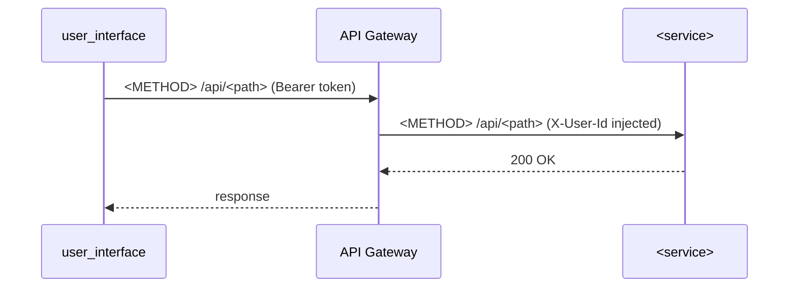

# PLAN.md Template

Use this exact structure when writing `specs/<feature-slug>/PLAN.md`.
This document bridges the SPEC.md (what) to the TASKS.md (who does what).

---

```markdown
# Technical Plan: <Feature Name>

**Based on:** `specs/<slug>/SPEC.md`  
**Created:** <YYYY-MM-DD>

---

## Architecture Decisions

List key technical choices made and why:

1. **<Decision>** — <rationale>
2. **<Decision>** — <rationale>

---

## Service Breakdown

For each affected service, provide a precise file-level plan.

---

### `<service-name>` (Python / FastAPI / hexagonal)

**Pattern:** Hexagonal architecture — new use case in `application/`, adapter in `infrastructure/`

**Files to create:**
```
services/<service>/domain/<entity>.py          — <description>
services/<service>/application/<use_case>.py   — <description>
services/<service>/infrastructure/<adapter>.py — <description>
```

**Files to modify:**
```
services/<service>/controllers.py        — add route <METHOD> /<path>
services/<service>/main.py               — register new router (if new file)
```

**DB migration:** Yes — add column `<col>` to table `<table>`  
**Migration command:** `uv run alembic revision --autogenerate -m "<description>"`

---

### `poc_properties` (Java / Spring Boot / CQRS)

**Pattern:** CQRS — new Command class + CommandHandler, or new Query class + QueryHandler

**Files to create:**
```
src/main/java/.../business/command/<Name>Command.java       — <description>
src/main/java/.../business/command/<Name>CommandHandler.java — <description>
src/main/java/.../business/mapper/<Name>Mapper.java          — MapStruct mapper (if new entity)
```

**Files to modify:**
```
src/main/java/.../controllers/<Controller>.java  — add endpoint
src/main/java/.../infrastructure/persistence/<Repo>.java — add query method (if needed)
```

**DB migration:** Yes / No  
**Migration:** JPA auto-DDL / Flyway script `V<N>__<description>.sql`

---

### `<PricingEngine | PricingOrchestator>` (.NET 8 / ASP.NET Core)

**Pattern:** Controller + EF Core repository or minimal API

**Files to create:**
```
<Service>/Controllers/<Name>Controller.cs  — <description>
<Service>/Models/<Name>.cs                 — EF Core entity (if new)
```

**Files to modify:**
```
<Service>/Program.cs         — register new service/controller if needed
<ServiceTests>/...           — update test project
```

**DB migration:**  
```
dotnet ef migrations add <MigrationName> --project <Service>
dotnet ef database update --project <Service>
```

---

### `user_interface` (Angular 20 / Ionic 8 / TypeScript)

**Pattern:** Lazy-loaded page module + Ionic components + service injection

**Files to create:**
```
user_interface/src/app/<feature>/
├── <feature>.page.ts        — page component
├── <feature>.page.html      — Ionic template
├── <feature>.page.scss      — styles
└── <feature>.module.ts      — lazy-loaded module (if new route)
user_interface/src/app/services/<feature>.service.ts  — HTTP calls to API Gateway
```

**Files to modify:**
```
user_interface/src/app/app-routing.module.ts  — add route (if new page)
user_interface/src/app/services/api.service.ts — add method (if shared service)
```

---

## Interface Contracts

### Service-to-service calls

List any new HTTP calls between internal services:

| Caller | Callee | Method | Path | Notes |
|---|---|---|---|---|
| `booking_orchestrator` | `booking` | POST | `/api/booking/` | Forwards X-User-Id |
| `booking_orchestrator` | `poc_properties` | POST | `/api/property/lock` | Converts dates to dd/MM/yyyy |

### New domain events (SQS / notifications)

List new event types published to `notifications_queue`. Include all fields — the
`notifications` service uses these to build transactional emails:

| Event Type | Publisher | Consumers | Trigger | Payload fields |
|---|---|---|---|---|
| `BOOKING_<ACTION>` | `booking_orchestrator` | `notifications` | <action that triggers it> | `booking_id`, `user_email`, `property_name`, ... |

---

## Cross-Service Dependency Diagram



---

## Risk Flags

Items that could cause issues during implementation:

- **<Risk>** — <mitigation>
- **<Risk>** — <mitigation>

---

## Implementation Order

Recommended sequence to minimize blocking:

1. Backend services (independent of each other)
2. Frontend (depends on backend API contract, can use mock data first)
3. Integration (connect frontend to deployed backend)
```
