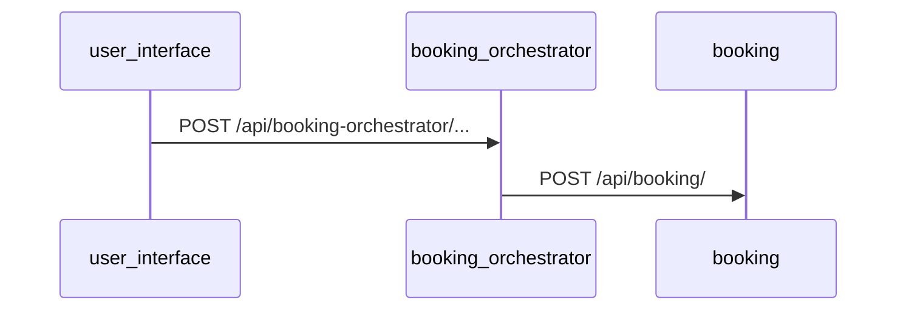

# SPEC.md Template

Use this exact structure when writing `specs/<feature-slug>/SPEC.md`.
Replace all `<placeholders>` with real content. Remove sections that don't apply.

---

```markdown
# Feature: <Feature Name>

**Status:** Draft  
**Created:** <YYYY-MM-DD>  
**Author:** <user name>  
**Slug:** `<feature-slug>`

---

## Summary

> One or two sentences describing what this feature does and why it exists.

---

## Problem Statement

Describe the problem or gap this feature addresses. Be specific:
- Who is affected?
- What can't they do today?
- What does success look like?

---

## Acceptance Criteria

Numbered, testable criteria. Each item must be verifiable by the review-engineer.

1. [ ] <Criterion 1 — observable behavior, e.g., "GET /api/ratings returns a list of ratings for a property">
2. [ ] <Criterion 2>
3. [ ] <Criterion 3>
...

---

## Affected Services

| Service | Language | Changes | Notes |
|---|---|---|---|
| `<service-name>` | Python/FastAPI | New endpoint, DB migration | See API Contracts + Data Model |
| `poc_properties` | Java/Spring Boot | New Command + Query | See API Contracts |
| `PricingEngine` | .NET 8 | Modified pricing logic | No schema change |
| `user_interface` | Angular/Ionic | New page component | Depends on booking API contract |

---

## API Contracts

### New Endpoints

#### `<METHOD> /api/<service>/<path>`

**Service:** `<service-name>`  
**Auth:** JWT required / Public  
**Description:** <what it does>

**Request body:**
```json
{
  "field": "type — description"
}
```

**Response (200):**
```json
{
  "field": "type — description"
}
```

**Error responses:**
- `400` — <condition>
- `404` — <condition>
- `409` — <condition>

---

### Modified Endpoints

#### `<METHOD> /api/<service>/<path>` *(existing)*

**Change:** <describe what changes and why>

---

## Data Model Changes

### `<service-name>` — <table/entity name>

**New fields:**
| Field | Type | Nullable | Default | Description |
|---|---|---|---|---|
| `<field>` | `<type>` | No | — | <description> |

**Migration required:** Yes / No

---

## Cross-Service Communication

> Describe which services call which, and the trigger. Use a mermaid sequence diagram if helpful.



---

## Out of Scope

Explicitly list what this feature does NOT include to prevent scope creep:

- <Item 1>
- <Item 2>

---

## Open Questions

Questions that were unresolved at spec time. The docs-engineer will update these after implementation.

| # | Question | Resolution |
|---|---|---|
| 1 | <question> | Pending |

---

## Notes

Any additional context, constraints, or references.
```
