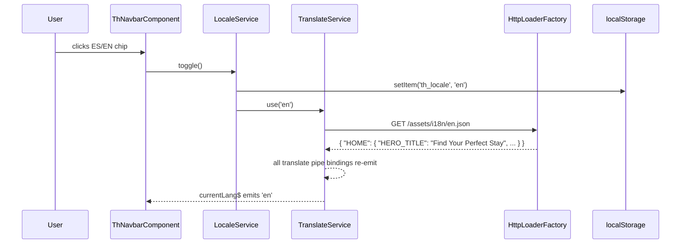

# Technical Plan: i18n — Runtime Language Toggle (English / Spanish)

**Based on:** `specs/add-i18n-language-toggle/SPEC.md`  
**Created:** 2026-05-05

---

## Architecture Decisions

1. **`LocaleService` as the single locale state manager** — wraps `TranslateService`, persists to `localStorage['th_locale']`, and exposes `currentLang$` (Observable), `localeCode` (sync getter: `'es-CO'` | `'en-US'`), and `currencyCode` (sync getter: `'COP'` | `'USD'`). Components inject this instead of `TranslateService` directly, keeping locale logic centralized.

2. **`SharedCommonModule` re-exports `TranslateModule`** — the four NgModule-based traveler pages (home, search-results, booking-list, propertydetail) all import their own lazy-loaded modules; re-exporting from `SharedCommonModule` means one addition per page module covers template pipe access. Pages already importing `SharedCommonModule` need zero change.

3. **`TranslateModule` added directly to standalone component `imports`** — for all standalone pages (login, register, booking-detail, notifications in traveler app; all five portal-hoteles pages) and for all standalone shared components (`ThNavbarComponent`, `ThDatetimeModalComponent`, `PortalHotelesHeaderBarComponent`). Angular standalone components cannot inherit from shared NgModules.

4. **Locale restored in `APP_INITIALIZER`** — both `AppModule`s add a second `APP_INITIALIZER` factory that calls `LocaleService.init()`, which reads `localStorage['th_locale']` and calls `translate.use()`. This fires before the app renders, avoiding a flash of English content.

5. **`registerLocaleData` in both `AppModule`s** — Angular's `CurrencyPipe` requires locale data to be registered at bootstrap for non-default locales. `localeEsCO` (from `@angular/common/locales/es-CO`) is registered so the `'es-CO'` locale string works in pipes.

6. **Currency formatted via `Intl.NumberFormat` in `LocaleService.formatCurrency()`** — the `th-hotel-card` component takes `[price]` as a pre-formatted string, so the `getHotelPrice()` methods in search-results and booking-list call `LocaleService.formatCurrency(amount)` which uses `Intl.NumberFormat` with the current locale and currency code. This is reactive: components subscribe to `currentLang$` and trigger change detection.

7. **`ion-datetime` locale driven by `LocaleService.localeCode`** — `ThDatetimeModalComponent` injects `LocaleService` and exposes a `get dateLocale()` getter used in the template as `[locale]="dateLocale"`.

---

## Service Breakdown

---

### `user_interface` — package & build config

**Files to modify:**
```
user_interface/package.json       — add @ngx-translate/core ^15, @ngx-translate/http-loader ^8
user_interface/angular.json       — add src/assets/i18n glob to traveler app assets array;
                                    add projects/portal-hoteles/src/assets/i18n glob to portal assets array
```

**Install command:**
```bash
cd user_interface && npm install @ngx-translate/core @ngx-translate/http-loader
```

---

### `user_interface` — translation JSON assets

**Files to create:**
```
user_interface/src/assets/i18n/en.json                             — English keys (traveler app)
user_interface/src/assets/i18n/es.json                             — Spanish keys (traveler app)
user_interface/projects/portal-hoteles/src/assets/i18n/en.json     — English keys (portal-hoteles)
user_interface/projects/portal-hoteles/src/assets/i18n/es.json     — Spanish keys (portal-hoteles)
```

**Traveler `en.json` key namespaces:** `NAV`, `LOGIN`, `REGISTER`, `HOME`, `SEARCH`, `PROPERTY`, `BOOKING_LIST`, `BOOKING_DETAIL`, `NOTIFICATIONS`, `COMMON`

**Portal `en.json` key namespaces:** `NAV`, `LOGIN`, `DASHBOARD`, `DASHBOARD_RESERVATION`, `PRICING`, `REPORTS`, `COMMON`

---

### `user_interface` — `LocaleService` (new)

**File to create:**
```
user_interface/src/app/core/services/locale.service.ts   — locale state manager
```

**Interface contract:**
```typescript
@Injectable({ providedIn: 'root' })
export class LocaleService {
  readonly currentLang$: Observable<string>;  // emits 'es' | 'en' on every switch
  readonly LOCALE_KEY = 'th_locale';

  get currentLang(): string          // 'es' | 'en'
  get localeCode(): string           // 'es-CO' | 'en-US'
  get currencyCode(): string         // 'COP' | 'USD'

  init(): void                       // called in APP_INITIALIZER — restores from localStorage
  toggle(): void                     // switches between 'es' and 'en', persists to localStorage
  formatCurrency(amount: number): string   // uses Intl.NumberFormat with current locale+currency
}
```

---

### `user_interface` — traveler `AppModule`

**File to modify:**
```
user_interface/src/app/app.module.ts
```

**Changes:**
- Import `TranslateModule.forRoot({ loader: { provide: TranslateLoader, useFactory: HttpLoaderFactory, deps: [HttpClient] }, defaultLanguage: 'es' })`
- Add `HttpLoaderFactory` function: `export function HttpLoaderFactory(http: HttpClient) { return new TranslateHttpLoader(http, './assets/i18n/', '.json'); }`
- Call `registerLocaleData(localeEsCO, 'es-CO')` at module level
- Add second `APP_INITIALIZER` entry using `LocaleService.init()`

---

### `user_interface` — traveler `SharedCommonModule`

**File to modify:**
```
user_interface/src/app/shared/common/common.module.ts
```

**Changes:**
- Add `TranslateModule` to both `imports` and `exports` so all NgModule-based page modules that import `SharedCommonModule` automatically have the `translate` pipe available.

---

### `user_interface` — traveler NgModule-based pages

For pages loaded via `loadChildren` (own `*.module.ts`):

**Files to modify:**
```
user_interface/src/app/pages/home/home.module.ts           — already imports SharedCommonModule (no change needed)
user_interface/src/app/pages/search-results/search-results.module.ts  — add SharedCommonModule
user_interface/src/app/pages/booking-list/booking-list.module.ts      — add SharedCommonModule
user_interface/src/app/pages/propertydetail/propertydetail.module.ts  — add SharedCommonModule
```

**Page TypeScript files to modify:**
```
user_interface/src/app/pages/home/home.page.ts
  — inject LocaleService; subscribe to currentLang$ to refresh translate.instant() calls
    for PlatformTextDirective inputs (HERO_SUBTITLE_WEB / HERO_SUBTITLE_MOBILE); inject TranslateService

user_interface/src/app/pages/search-results/search-results.page.ts
  — inject LocaleService; subscribe to currentLang$ and store locale; replace getHotelPrice()
    to call LocaleService.formatCurrency(hotel.pricePerNight ?? 0)

user_interface/src/app/pages/booking-list/booking-list.page.ts
  — inject LocaleService; replace Intl.NumberFormat call with LocaleService.formatCurrency()

user_interface/src/app/pages/propertydetail/propertydetail.page.ts
  — inject TranslateService for any .ts-generated strings (alertTitle, cancelConfirmMessage)
```

**Page HTML files to modify:**
```
user_interface/src/app/pages/home/home.page.html
  — replace hardcoded hero title with {{ 'HOME.HERO_TITLE' | translate }}
  — replace hardcoded filter labels/placeholders with translate pipe inputs

user_interface/src/app/pages/search-results/search-results.page.html
  — replace 'hotel found' / 'hotels found' with translate keys (SEARCH.HOTEL_FOUND_ONE / SEARCH.HOTELS_FOUND)
  — replace 'View Details', 'Loading hotels...' etc. with translate keys

user_interface/src/app/pages/booking-list/booking-list.page.html
  — replace 'See Details', 'Loading reservations...', 'Total' prefix with translate keys

user_interface/src/app/pages/propertydetail/propertydetail.page.html
  — replace 'View all N photos', 'About This Hotel', 'Book Now', etc. with translate keys
```

---

### `user_interface` — traveler standalone pages

For pages loaded via `loadComponent`:

**Files to modify (TypeScript):**
```
user_interface/src/app/pages/login/login.page.ts
  — add TranslateModule to standalone component imports array

user_interface/src/app/pages/register/register.page.ts
  — add TranslateModule to standalone component imports array

user_interface/src/app/pages/booking-detail/booking-detail.page.ts
  — add TranslateModule to standalone component imports array

user_interface/src/app/pages/notifications/notifications.page.ts
  — add TranslateModule to standalone component imports array (if translatable strings exist)
```

**Files to modify (HTML):**
```
user_interface/src/app/pages/login/login.page.html
  — replace 'Welcome Back', 'Sign in to...', 'Email', 'Password', 'Sign In', etc. with translate keys

user_interface/src/app/pages/register/register.page.html
  — replace 'Create Account', 'Full Name', 'Sign Up', etc. with translate keys

user_interface/src/app/pages/booking-detail/booking-detail.page.html
  — replace 'Cancel booking' with {{ 'BOOKING_DETAIL.CANCEL_BOOKING' | translate }}

user_interface/src/app/pages/notifications/notifications.page.html
  — replace any hardcoded user-visible strings
```

---

### `user_interface` — shared standalone components

**Files to modify:**
```
user_interface/src/app/shared/components/th-navbar/th-navbar.component.ts
  — add TranslateModule to imports array
  — inject LocaleService
  — add toggleLanguage() method: calls LocaleService.toggle()
  — add get currentLang(): string — delegates to LocaleService.currentLang

user_interface/src/app/shared/components/th-navbar/th-navbar.component.html
  — replace 'Search', 'Bookings', 'Sign In', 'Sign Up' with translate keys
  — add language toggle chip in desktop actions area:
    <ion-chip class="th-navbar__chip th-navbar__chip--lang" (click)="toggleLanguage()">
      <ion-label>{{ currentLang === 'es' ? 'ES' : 'EN' }}</ion-label>
    </ion-chip>

user_interface/src/app/shared/components/th-datetime-modal/th-datetime-modal.component.ts
  — inject LocaleService
  — add get dateLocale(): string — returns LocaleService.localeCode ('es-CO' | 'en-US')

user_interface/src/app/shared/components/th-datetime-modal/th-datetime-modal.component.html
  — replace locale="es-ES" with [locale]="dateLocale"
```

---

### `user_interface` — portal-hoteles `AppModule`

**File to modify:**
```
user_interface/projects/portal-hoteles/src/app/app.module.ts
```

**Changes:** Same pattern as traveler AppModule — `TranslateModule.forRoot()` with `HttpLoaderFactory` pointing to `./assets/i18n/`. Add `APP_INITIALIZER` for `LocaleService.init()`. Register `localeEsCO`.

---

### `user_interface` — portal-hoteles standalone pages

All portal pages are standalone components (loaded via `loadComponent`):

**Files to modify (TypeScript):**
```
user_interface/projects/portal-hoteles/src/app/pages/login/login.page.ts
user_interface/projects/portal-hoteles/src/app/pages/dashboard/dashboard.page.ts
user_interface/projects/portal-hoteles/src/app/pages/dashboard-reservation/dashboard-reservation.page.ts
user_interface/projects/portal-hoteles/src/app/pages/pricing-configuration/pricing-configuration.page.ts
user_interface/projects/portal-hoteles/src/app/pages/reports/reports.page.ts
  — each: add TranslateModule to standalone imports array
```

**Files to modify (HTML):**
```
All five pages above: replace hardcoded strings with {{ 'KEY' | translate }}
```

---

### `user_interface` — `PortalHotelesHeaderBarComponent`

**Files to modify:**
```
user_interface/src/app/shared/components/portal-hoteles/header-bar/portal-hoteles-header-bar.component.ts
  — add TranslateModule to imports array
  — inject LocaleService
  — add toggleLanguage() and get currentLang() delegating to LocaleService

user_interface/src/app/shared/components/portal-hoteles/header-bar/portal-hoteles-header-bar.component.html
  — add language toggle chip following th-navbar pattern
  — translate any header bar labels
```

---

### `user_interface` — E2E test

**File to create:**
```
user_interface/e2e/web/i18n-toggle.spec.ts   — Playwright E2E test
```

**Test scenarios:**
1. Navigate to `/home` (mocking translation file responses and hotel API)
2. Assert hero title shows Spanish text (`'Encuentra tu alojamiento perfecto'`)
3. Click the language toggle chip in the navbar
4. Assert hero title switches to English (`'Find Your Perfect Stay'`)
5. Click toggle again → assert switches back to Spanish
6. Reload page → assert Spanish persists from localStorage

---

## Interface Contracts

### Client-side only — no new backend calls

| Caller | Asset | Transport | Notes |
|---|---|---|---|
| `TranslateHttpLoader` | `GET /assets/i18n/en.json` | HTTP (client) | Served by Angular dev server / Nginx |
| `TranslateHttpLoader` | `GET /assets/i18n/es.json` | HTTP (client) | Cached after first load by ngx-translate |
| `TranslateHttpLoader` | `GET /assets/i18n/en.json` | HTTP (client) | Portal-hoteles project (own assets path) |

---

## Cross-Service Dependency Diagram



---

## Risk Flags

- **`PlatformTextDirective` bypasses the pipe** — the home page uses `[appPlatformTextWeb]` and `[appPlatformTextMobile]` with raw string inputs. These must be wrapped with `translate.instant()` in `home.page.ts` and refreshed on `currentLang$` changes, otherwise the hero subtitle won't switch language. Mitigation: subscribe to `currentLang$` in `OnInit` and update a local `heroSubtitleWeb` / `heroSubtitleMobile` property.

- **Portal assets path mismatch** — portal-hoteles loads from its own build output; the `HttpLoaderFactory` base href must be `'./assets/i18n/'` (relative), not an absolute path. The angular.json assets glob for the portal project must include `projects/portal-hoteles/src/assets/i18n` mapped to `assets/i18n`. Mitigation: verify with `ng build portal-hoteles --dry-run` and check the output `assets/` folder.

- **`CurrencyPipe` locale data not registered** — Angular will throw `Missing locale data for the locale "es-CO"` at runtime if `registerLocaleData` is not called. Mitigation: call it at the top of both `AppModule` files before `@NgModule`.

- **Karma test bed failures** — existing unit tests for components that now use `{{ 'KEY' | translate }}` will fail with "The pipe 'translate' could not be found" unless `TranslateModule.forRoot()` (with `TranslateFakeLoader`) or `TranslateTestingModule` is added to every affected test bed. Mitigation: test-engineer adds this to all affected `*.spec.ts` files.

- **ngx-translate version compatibility with Angular 20** — `@ngx-translate/core` v15+ supports Angular 17+. Angular 20 should be covered but verify `peerDependencies` in the published package. Mitigation: if the version check fails, pin to the last confirmed compatible release.

---

## Implementation Order

1. **Install packages + create translation JSON files** — unblocks all template work
2. **Create `LocaleService`** — unblocks all components and pages
3. **Wire `AppModule`s** (both traveler + portal) — unblocks app startup locale restore
4. **Update `SharedCommonModule`** — unblocks all NgModule pages
5. **Update shared standalone components** (`th-navbar`, `th-datetime-modal`, `portal-hoteles-header-bar`) — language toggle visible in UI
6. **Update all page templates** — replace hardcoded strings (can be done in parallel per page)
7. **Wire currency formatting in search-results + booking-list** — depends on LocaleService
8. **Write E2E test** — depends on toggle chip being rendered
