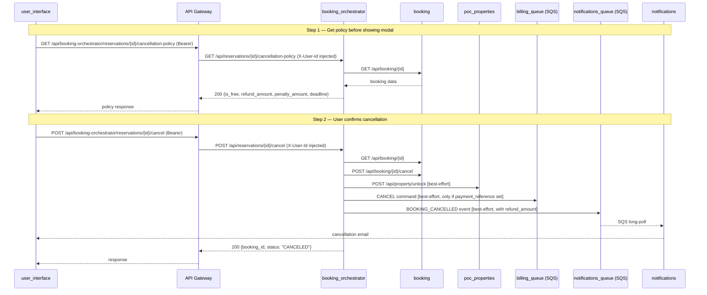

# Technical Plan: Cancel Reservation with Policy-Based Refund

**Based on:** `specs/cancel-reservation/SPEC.md`  
**Created:** 2026-04-24

---

## Architecture Decisions

1. **Policy computation lives in the domain layer** — `domain/cancellation_policy.py` holds the pure function `compute_cancellation_policy(period_start, price, payment_reference, now)`. This keeps the business rule isolated, clock-injectable (testable), and reusable by both the new GET endpoint and the cancel saga.

2. **Cancel saga does not block on side-effects** — Property unlock and billing CANCEL are both best-effort (logged on failure, not raised). This matches the existing pattern used for notification publishing (`make_payment.py`, `cancel_reservation.py`). The booking cancellation itself is the source-of-truth step; infrastructure side-effects are eventual.

3. **Refund info travels in the SQS BOOKING_CANCELLED event** — Both `booking_orchestrator/domain/events.py` and `notifications/domain/events.py` gain `refund_amount` + `penalty_amount` fields. The `from_message()` deserialization uses `.get(..., "0.00")` so existing events without these fields don't break the consumer (backward compatible).

4. **No new PropertyUnlockError exception** — The `unlock()` adapter raises the generic `PropertyLockError` on failure (it's the same kind of network/service problem). The cancel saga catches it and logs without re-raising, exactly like other best-effort steps.

5. **GET policy endpoint uses the existing `BookingClient.get()` adapter** — No new HTTP client or port needed. The new `GetCancellationPolicyUseCase` re-uses the existing `BookingClient` port and adds a `GetCancellationPolicyCommand` to the commands module.

---

## Service Breakdown

---

### `booking_orchestrator` (Python / FastAPI / hexagonal)

**Pattern:** Hexagonal architecture — domain function, new use case, enhanced cancel saga, enhanced adapters.

**Files to create:**

```
services/booking_orchestrator/src/booking_orchestrator/domain/cancellation_policy.py
    — Pure domain function compute_cancellation_policy() + CancellationPolicy dataclass.
    — Takes period_start (ISO str), price (Decimal), payment_reference (str|None), now (datetime).
    — Returns CancellationPolicy(is_free, refund_amount, penalty_amount, deadline).

services/booking_orchestrator/src/booking_orchestrator/application/get_cancellation_policy.py
    — GetCancellationPolicyUseCase: fetches booking via BookingClient, computes policy, returns dict.
```

**Files to modify:**

```
services/booking_orchestrator/src/booking_orchestrator/application/commands.py
    — Add GetCancellationPolicyCommand(booking_id: str).

services/booking_orchestrator/src/booking_orchestrator/application/ports.py
    — PropertyClient protocol: add async unlock(property_id, period_start, period_end) -> None.
    — BillingPublisher protocol: add async publish_cancel(booking_id, reason) -> None.

services/booking_orchestrator/src/booking_orchestrator/application/cancel_reservation.py
    — Constructor: add property_client: PropertyClient, billing_publisher: BillingPublisher.
    — After cancel step: call compute_cancellation_policy() with booking data.
    — New Step 3: await self._property.unlock(...) [best-effort, catch PropertyLockError].
    — New Step 4: if booking.get("payment_reference"): await self._billing.publish_cancel(...) [best-effort].
    — Step 5 (was 3): publish BookingCancelledEvent with refund_amount + penalty_amount added.

services/booking_orchestrator/src/booking_orchestrator/domain/events.py
    — BookingCancelledEvent: add refund_amount: Decimal, penalty_amount: Decimal fields.
    — to_message(): include "refund_amount" and "penalty_amount" in booking dict.

services/booking_orchestrator/src/booking_orchestrator/infrastructure/httpx_property_client.py
    — Add async unlock(property_id, period_start, period_end) -> None.
    — POST to /api/property/unlock with {propertyDetailId, startDate, endDate} in dd/MM/yyyy.
    — Raise PropertyLockError on non-204 response (same error as lock — reuses existing exception).

services/booking_orchestrator/src/booking_orchestrator/infrastructure/sqs_billing_publisher.py
    — Add async publish_cancel(booking_id: str, reason: str) -> None.
    — Publishes {"operation": "CANCEL", "payload": {"bookingId": ..., "reason": ...}} to billing_queue.

services/booking_orchestrator/src/booking_orchestrator/bootstrap.py
    — get_cancel_reservation_use_case: add PropertyClientDep + BillingPublisherDep parameters.
    — Add get_get_cancellation_policy_use_case(booking_client) -> GetCancellationPolicyUseCase.

services/booking_orchestrator/src/booking_orchestrator/controllers.py
    — Add GetCancellationPolicyUseCaseDep type alias.
    — Add GET /api/reservations/{booking_id}/cancellation-policy route.
    — Returns CancellationPolicyResponse; maps BookingNotFoundError → 404.

services/booking_orchestrator/src/booking_orchestrator/schemas.py
    — Add CancellationPolicyResponse(booking_id, is_free_cancellation, refund_amount,
      penalty_amount, cancellation_deadline) Pydantic model.
```

**DB migration:** No

---

### `notifications` (Python / FastAPI / hexagonal)

**Pattern:** Update domain event deserialization + handler email template.

**Files to modify:**

```
services/notifications/src/notifications/domain/events.py
    — BookingCancelledEvent: add refund_amount: str, penalty_amount: str fields.
    — from_message(): parse booking["refund_amount"] and booking["penalty_amount"]
      using .get(..., "0.00") for backward compatibility.

services/notifications/src/notifications/application/handle_booking_cancelled.py
    — Update email body to include refund and penalty amounts.
    — Show different message wording depending on whether refund_amount > 0.
```

**DB migration:** No

---

## Interface Contracts

### Service-to-service calls

| Caller | Callee | Method | Path | Payload / Notes |
|---|---|---|---|---|
| `booking_orchestrator` | `booking` | GET | `/api/booking/{id}` | Existing — re-used by policy endpoint |
| `booking_orchestrator` | `poc_properties` | POST | `/api/property/unlock` | `{propertyDetailId, startDate, endDate}` in dd/MM/yyyy — best-effort |
| `booking_orchestrator` | `billing_queue` (SQS) | publish | — | `{"operation":"CANCEL","payload":{"bookingId":"...","reason":"user_cancellation"}}` — best-effort |

### Modified domain events (SQS / notifications)

| Event Type | Change | Payload additions |
|---|---|---|
| `BOOKING_CANCELLED` | `booking` dict gains two new fields | `"refund_amount": "150.00"`, `"penalty_amount": "0.00"` |

---

## Cancellation Policy Domain Logic

```python
# domain/cancellation_policy.py

FREE_CANCELLATION_HOURS = 24
PENALTY_FRACTION = Decimal("0.5")

@dataclass(frozen=True)
class CancellationPolicy:
    is_free_cancellation: bool
    refund_amount: Decimal
    penalty_amount: Decimal
    cancellation_deadline: datetime  # = period_start_midnight_utc - 24h

def compute_cancellation_policy(
    period_start: str,      # ISO "YYYY-MM-DD"
    price: Decimal,
    payment_reference: str | None,
    now: datetime,          # must be timezone-aware (UTC)
) -> CancellationPolicy:
    start_dt = datetime.fromisoformat(period_start).replace(tzinfo=UTC)
    deadline = start_dt - timedelta(hours=FREE_CANCELLATION_HOURS)
    is_free = now < deadline

    if payment_reference is None:
        # No payment made — nothing to refund regardless of timing.
        return CancellationPolicy(True, Decimal("0.00"), Decimal("0.00"), deadline)

    if is_free:
        return CancellationPolicy(True, price, Decimal("0.00"), deadline)
    else:
        penalty = (price * PENALTY_FRACTION).quantize(Decimal("0.01"))
        return CancellationPolicy(False, price - penalty, penalty, deadline)
```

---

## Cross-Service Dependency Diagram



---

## Risk Flags

- **`period_start` is a date, not a datetime** — The booking service stores only a `date`. The policy treats it as midnight UTC on check-in day. This means a booking with `period_start = 2026-04-25` has a deadline of `2026-04-25T00:00:00Z - 24h = 2026-04-24T00:00:00Z`. Confirm this interpretation is acceptable (it is the most conservative for the traveler).

- **Backward-compatible SQS messages** — The `notifications` consumer may receive old `BOOKING_CANCELLED` messages (from before this change) that have no `refund_amount` field. The `.get("refund_amount", "0.00")` default in `from_message()` handles this gracefully.

- **Property unlock is idempotent in `poc_properties`** — The `UnlockPropertyCommandHandler` should tolerate repeated unlocks for the same period without errors. This should be verified in tests.

---

## Implementation Order

1. **`booking_orchestrator/domain/cancellation_policy.py`** — Pure domain function, no dependencies. Write and test first.
2. **`booking_orchestrator/domain/events.py`** — Add fields to `BookingCancelledEvent`.
3. **`booking_orchestrator/application/ports.py`** — Extend protocols.
4. **`booking_orchestrator/infrastructure/httpx_property_client.py`** — Add `unlock()`.
5. **`booking_orchestrator/infrastructure/sqs_billing_publisher.py`** — Add `publish_cancel()`.
6. **`booking_orchestrator/application/commands.py`** — Add `GetCancellationPolicyCommand`.
7. **`booking_orchestrator/application/get_cancellation_policy.py`** — New use case.
8. **`booking_orchestrator/application/cancel_reservation.py`** — Enhance saga (depends on 1–5).
9. **`booking_orchestrator/bootstrap.py`** — Wire new use case + update cancel wiring.
10. **`booking_orchestrator/schemas.py`** — Add response schema.
11. **`booking_orchestrator/controllers.py`** — Add GET endpoint.
12. **`notifications/domain/events.py`** — Update `BookingCancelledEvent`.
13. **`notifications/application/handle_booking_cancelled.py`** — Update email body.
