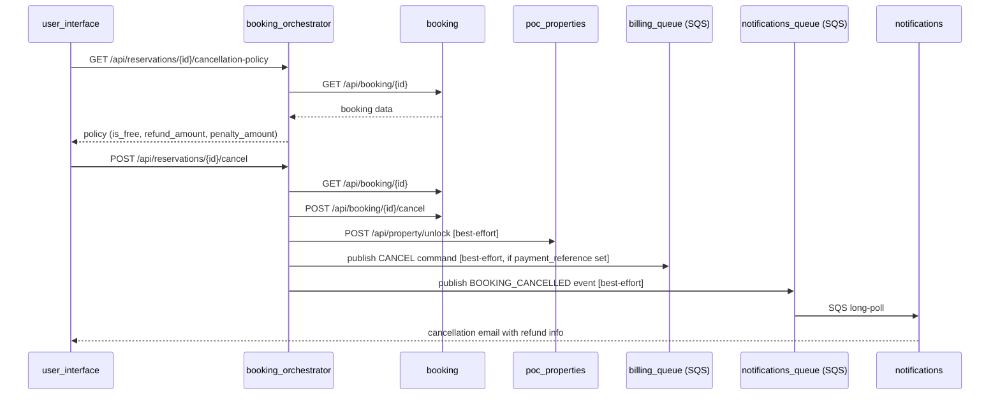

# Feature: Cancel Reservation with Policy-Based Refund

**Status:** Implemented  
**Created:** 2026-04-24  
**Implemented:** 2026-04-24  
**Author:** Angel Henao  
**Slug:** `cancel-reservation`

---

## Summary

Travelers can cancel a reservation at any time. The cancellation applies a time-based policy: free (100% refund) if cancelled ≥ 24 hours before check-in, or a 50% penalty (50% refund) if cancelled within 24 hours. The orchestrator unlocks the property and, when payment was already made, triggers a billing cancellation via SQS.

---

## Problem Statement

The existing cancel endpoint (`POST /api/reservations/{booking_id}/cancel`) only marks the booking as CANCELLED and sends an email. It neither unlocks the property in `poc_properties` nor triggers a refund through the `billing` service. Travelers have no way to know the financial impact of cancelling before they confirm.

- **Who is affected?** Travelers with active bookings.
- **What can't they do today?** They cannot cancel with awareness of the refund/penalty, and the backend doesn't complete the compensation side-effects (unlock + refund).
- **What does success look like?** A traveler calls the policy endpoint, sees the refund amount, confirms cancellation, and the system: marks the booking CANCELLED, unlocks the property, triggers the billing refund if applicable, and sends an informative email.

---

## Acceptance Criteria

1. [x] `GET /api/reservations/{booking_id}/cancellation-policy` returns `is_free_cancellation`, `refund_amount`, `penalty_amount`, and `cancellation_deadline` for a booking owned by the authenticated user.
2. [x] If the current time is ≥ 24 hours before `period_start`: `is_free_cancellation = true`, `refund_amount = price`, `penalty_amount = 0.00`.
3. [x] If the current time is < 24 hours before `period_start`: `is_free_cancellation = false`, `refund_amount = price * 0.5`, `penalty_amount = price * 0.5`.
4. [x] If `payment_reference` is `null` (no payment made): `refund_amount = 0.00`, `penalty_amount = 0.00` regardless of timing.
5. [x] `POST /api/reservations/{booking_id}/cancel` cancels the booking in the `booking` service (unchanged behavior).
6. [x] On cancellation, the orchestrator calls `POST /api/property/unlock` in `poc_properties` with the booking's `property_id`, `period_start`, and `period_end` (best-effort — failure is logged, not raised).
7. [x] On cancellation, if `payment_reference` is present, the orchestrator publishes a `CANCEL` command onto `billing_queue` with `bookingId` and `reason = "user_cancellation"` (best-effort).
8. [x] The `BOOKING_CANCELLED` SQS event includes `refund_amount` and `penalty_amount` fields so the notification email can show the refund to the traveler.
9. [x] The cancellation email sent by `notifications` includes the refund amount and the penalty amount.
10. [x] The policy endpoint returns `404` if the booking does not exist.
11. [x] The cancel endpoint returns `409` if the booking is already in a terminal state (CANCELED, COMPLETED, REJECTED).

---

## Affected Services

| Service | Language | Changes | Notes |
|---|---|---|---|
| `booking_orchestrator` | Python/FastAPI | New GET endpoint, enhanced cancel saga, new `unlock` + `publish_cancel` adapters | Primary service for this feature |
| `notifications` | Python/FastAPI | Update `HandleBookingCancelled` email template + `BookingCancelledEvent` domain model | Add refund/penalty fields to email body |
| `booking` | Python/FastAPI | No changes | Existing cancel use case is correct |
| `poc_properties` | Java/Spring Boot | No changes | `/api/property/unlock` endpoint already exists |
| `billing` | Java/Spring Boot | No changes | SQS `CANCEL` listener already exists |

---

## API Contracts

### New Endpoints

#### `GET /api/reservations/{booking_id}/cancellation-policy`

**Service:** `booking_orchestrator`  
**Auth:** JWT required (`X-User-Id` injected by API Gateway)  
**Description:** Returns the cancellation policy evaluation for a booking, computed at the moment of the request.

**Path parameters:**
- `booking_id` — UUID of the booking

**Response (200):**
```json
{
  "booking_id": "3fa85f64-5717-4562-b3fc-2c963f66afa6",
  "is_free_cancellation": true,
  "refund_amount": "150.00",
  "penalty_amount": "0.00",
  "cancellation_deadline": "2026-04-25T10:00:00+00:00"
}
```

**Policy rules (applied in order):**
1. If `payment_reference` is `null`: `refund_amount = 0.00`, `penalty_amount = 0.00`, `is_free_cancellation = true`.
2. If `now < period_start - 24h`: free cancellation (`refund_amount = price`, `penalty_amount = 0.00`).
3. Otherwise: penalty (`refund_amount = price * 0.5`, `penalty_amount = price * 0.5`).

`cancellation_deadline` is always `period_start - 24h` (UTC ISO-8601), regardless of payment status.

**Error responses:**
- `404` — Booking not found

---

### Modified Endpoints

#### `POST /api/reservations/{booking_id}/cancel` *(existing)*

**Change:** The saga now executes three additional steps after cancelling the booking:
1. Unlock property in `poc_properties` (best-effort).
2. If `payment_reference` is present, publish `CANCEL` to `billing_queue` (best-effort).
3. Include `refund_amount` and `penalty_amount` in the `BOOKING_CANCELLED` SQS event.

**Response** remains `{"booking_id": "...", "status": "CANCELED"}` — no schema change.

---

## Data Model Changes

No database schema changes required. All policy computation is in-memory.

### `booking_orchestrator` — `BookingCancelledEvent`

Two new fields added to the domain event (not persisted, used for SQS messaging only):

| Field | Type | Description |
|---|---|---|
| `refund_amount` | `Decimal` | Amount to be refunded to the traveler |
| `penalty_amount` | `Decimal` | Amount withheld as cancellation penalty |

---

## Cross-Service Communication



---

## Out of Scope

- Frontend modal/alert UI (handled by another engineer).
- Actual Stripe refund API call — `billing` service manages refund record creation only.
- Admin-initiated cancellations (admin flow is separate).
- Changes to the `booking` service domain model or state machine.
- Partial refunds for multi-night stays (policy applies to total price only).

---

## Open Questions

| # | Question | Resolution |
|---|---|---|
| 1 | Should the policy endpoint be scoped to the booking owner only, or visible to any authenticated user? | No ownership check implemented. The orchestrator does not cross-check X-User-Id against the booking owner — it relies on the booking service's existing auth model. |
| 2 | Should unlock failure during cancellation roll back the booking cancel? | Best-effort confirmed. Unlock failure is logged but does not roll back the booking cancellation. |

---

## Notes

- The `billing` service `CancelBillingCommandHandler` already exists and handles the SQS `CANCEL` operation — no Java changes needed.
- The `poc_properties` `/api/property/unlock` endpoint already exists — only the `HttpxPropertyClient` adapter needs a new `unlock()` method.
- The `billing` `SqsBillingPublisher` only has `publish_create` today — a `publish_cancel` method must be added.
- Policy computation uses `datetime.now(UTC)` vs `period_start` parsed as a date at midnight UTC (since the booking only stores a date, not a datetime).
