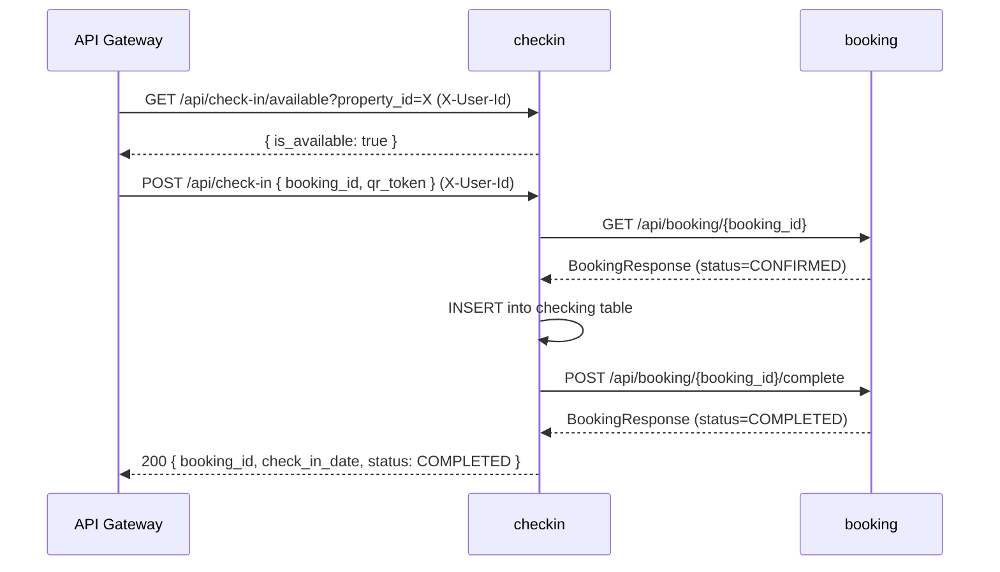

# Technical Plan: Digital Check-In

**Based on:** `specs/digital-checkin/SPEC.md`  
**Created:** 2026-05-02

---

## Architecture Decisions

1. **New standalone `checkin` microservice** — QR availability management is its own bounded context (it owns the `checking_available` and `checking` tables). Embedding it in `booking` or `booking_orchestrator` would mix concerns; a separate service is consistent with the team's existing design.
2. **Check-in service calls booking service directly (no orchestrator)** — The saga is only two steps: validate booking → complete booking. No compensating transaction needed (we validate before writing). Routing through `booking_orchestrator` would add latency and indirection with no benefit.
3. **`uuid4()` as QR token** — UUIDs are unguessable (128-bit random), URL-safe, and trivially generated. For a POC this is sufficient. Production would replace with a signed JWT.
4. **`Base.metadata.create_all` on startup** — Same pattern as `booking` and `notifications` services. No Alembic; the new service is greenfield.
5. **`uuid4()` as QR token stored as VARCHAR** — Simple to generate, unguessable, and passes cleanly through JSON and QR encoding without escaping. No separate token type needed.
6. **API Gateway route for `checkin` requires JWT** — Both `/check-in/available` and `/check-in` endpoints require a valid Cognito Bearer token. Only the POC registration endpoint (`POST /check-in/available`) is kept simple by being public — this matches the existing pattern where auth-registration endpoints are also public.

---

## Service Breakdown

---

### `checkin` (new — Python / FastAPI / hexagonal)

**Pattern:** Hexagonal architecture identical to `booking` service — domain dataclasses, application use cases, infrastructure SQLAlchemy adapter + httpx client, FastAPI controllers layer.

**Files to create:**
```
services/checkin/
├── src/checkin/
│   ├── __init__.py
│   ├── main.py                              — FastAPI app factory + lifespan (create_all)
│   ├── config.py                            — Settings: DB_*, BOOKING_SERVICE_URL
│   ├── database.py                          — async engine, Base, get_session (mirrors booking/database.py)
│   ├── controllers.py                       — 3 routes: POST /available, GET /available, POST /
│   ├── bootstrap.py                         — DI factories for all 3 use cases + httpx client
│   ├── schemas.py                           — Pydantic request/response models
│   ├── domain/
│   │   ├── __init__.py
│   │   ├── exceptions.py                    — PropertyAlreadyRegisteredError, QrTokenMismatchError,
│   │   │                                       BookingNotConfirmedError, BookingOwnershipError
│   │   └── value_objects.py                 — CheckingAvailable, CheckInRecord (frozen dataclasses)
│   ├── application/
│   │   ├── __init__.py
│   │   ├── commands.py                      — RegisterPropertyCommand, PerformCheckInCommand,
│   │   │                                       CheckAvailabilityQuery
│   │   ├── ports.py                         — CheckInRepository (Protocol), BookingClient (Protocol)
│   │   ├── register_property.py             — RegisterPropertyUseCase
│   │   ├── check_availability.py            — CheckAvailabilityUseCase
│   │   └── perform_checkin.py               — PerformCheckInUseCase (orchestrates validation + booking call)
│   └── infrastructure/
│       ├── __init__.py
│       ├── models.py                        — CheckingAvailableModel, CheckingModel (SQLAlchemy ORM)
│       ├── sqlalchemy_checkin_repo.py       — CheckInRepository adapter (async SQLAlchemy)
│       └── httpx_booking_client.py          — BookingClient adapter: GET /api/booking/{id},
│                                               POST /api/booking/{id}/complete
├── tests/
│   ├── __init__.py
│   ├── unit/
│   │   ├── __init__.py
│   │   ├── test_register_property.py        — RegisterPropertyUseCase unit tests (in-memory repo)
│   │   ├── test_check_availability.py       — CheckAvailabilityUseCase unit tests
│   │   └── test_perform_checkin.py          — PerformCheckInUseCase unit tests (mock booking client)
│   └── integration/
│       ├── __init__.py
│       └── test_controllers.py              — FastAPI TestClient integration tests
├── Dockerfile                               — mirrors booking/Dockerfile (python:3.13-slim, uv, port 80)
└── pyproject.toml                           — same deps as booking + httpx (already a dev dep in booking)
```

**Key domain types:**

```python
# domain/value_objects.py
@dataclass(frozen=True)
class CheckingAvailable:
    id: UUID
    property_id: UUID
    qr_token: str          # uuid4 string stored as VARCHAR(255)

@dataclass(frozen=True)
class CheckInRecord:
    id: UUID
    booking_id: UUID
    check_in_date: date
```

**Key application ports:**

```python
# application/ports.py
class CheckInRepository(Protocol):
    async def save_available(self, record: CheckingAvailable) -> None: ...
    async def get_available_by_property(self, property_id: UUID) -> CheckingAvailable | None: ...
    async def get_available_by_token(self, qr_token: str) -> CheckingAvailable | None: ...
    async def save_checkin(self, record: CheckInRecord) -> None: ...

class BookingClient(Protocol):
    async def get(self, booking_id: str) -> dict: ...
    async def complete(self, booking_id: str) -> dict: ...
```

**`PerformCheckInUseCase` logic:**
1. Fetch `CheckingAvailable` by `qr_token` → raise `QrTokenMismatchError` (→ 400) if not found
2. Fetch booking from `BookingClient.get(booking_id)` → raise `BookingNotFoundError` (→ 404) if not found
3. Verify `booking["user_id"] == command.user_id` → raise `BookingOwnershipError` (→ 403)
4. Verify `booking["property_id"] == str(checkin_available.property_id)` → raise `QrTokenMismatchError` (→ 400)
5. Verify `booking["status"] == "CONFIRMED"` → raise `BookingNotConfirmedError` (→ 409)
6. `INSERT` into `checking` table via `repo.save_checkin`
7. Call `BookingClient.complete(booking_id)` → transitions booking to COMPLETED
8. Return `CheckInResult(booking_id, check_in_date=today, status="COMPLETED")`

**Config:**
```python
# config.py — new env vars injected by ecs_api module
BOOKING_SERVICE_URL: str = "http://localhost:8001"
# DB_* vars same pattern as booking service
```

**DB migration:** Tables created via `Base.metadata.create_all` on startup (no Alembic).

---

### `booking` (existing — Python / FastAPI / hexagonal)

**Pattern:** Add one new use case following the exact same pattern as the 10 existing ones.

**Files to create:**
```
services/booking/src/booking/application/complete_booking.py  — CompleteBookingUseCase
```

**Files to modify:**
```
services/booking/src/booking/application/commands.py   — add CompleteBookingCommand(booking_id: str)
services/booking/src/booking/bootstrap.py              — add get_complete_booking_use_case factory
services/booking/src/booking/controllers.py            — add POST /{booking_id}/complete route
```

**`CompleteBookingUseCase` implementation:**
```python
class CompleteBookingUseCase:
    def __init__(self, booking_repository: BookingRepository) -> None:
        self._booking_repo = booking_repository

    async def execute(self, command: CompleteBookingCommand) -> Booking:
        booking = await self._booking_repo.get_by_id(UUID(command.booking_id))
        booking.complete()              # existing domain method: CONFIRMED → COMPLETED
        await self._booking_repo.save(booking)
        return booking
```

**New controller route:**
```python
@router.post("/{booking_id}/complete", response_model=BookingResponse)
async def complete_booking(
    booking_id: UUID,
    use_case: CompleteBookingDep,
) -> BookingResponse:
    # handles BookingNotFoundError (404), InvalidBookingStatusTransitionError (409)
```

No DB migration needed — the `status` column already holds string values and `COMPLETED` is already a valid `BookingStatus` enum member.

---

## Interface Contracts

### Service-to-service calls

| Caller | Callee | Method | Path | Notes |
|---|---|---|---|---|
| `checkin` | `booking` | GET | `/api/booking/{booking_id}` | Verify status=CONFIRMED and user_id ownership |
| `checkin` | `booking` | POST | `/api/booking/{booking_id}/complete` | Transition CONFIRMED → COMPLETED (VPC-internal) |

**SSM param needed by `checkin` service:** `/final-project-miso/booking/service_url`
(already auto-created by `ecs_api` stack for the `booking` service — just reference it in tfvars)

### New domain events

None — no notifications published for check-in in this sprint.

---

## Cross-Service Dependency Diagram



---

## Infrastructure / CI-CD Changes

### `terraform/environments/develop/container_registry/terraform.tfvars`
Add to `repository_names`:
```hcl
"api_checkin"
```

### `terraform/environments/develop/ecs_api/terraform.tfvars`
Add service block:
```hcl
"checkin" = {
  ecr_repository_name       = "api_checkin"
  container_name            = "api_checkin"
  ecs_task_size             = { cpu = 256, memory = 512 }
  create_database           = true
  desired_count_tasks       = 1
  placement_constraint_type = ""
  autoscaling = {
    max_capacity = 1
    min_capacity = 1
  }
  secrets = [
    {
      name      = "BOOKING_SERVICE_URL"
      valueFrom = "/final-project-miso/booking/service_url"
    }
  ]
}
```

### `terraform/environments/develop/api_gateway/terraform.tfvars`
Add `"checkin"` to `service_names`. Do NOT add to `public_services` — both endpoints require JWT.

### `.github/workflows/deploy_apps.yml`
Add to **test** matrix:
```yaml
- name: checkin
  language: python
  context-path: services/checkin
```
Add to **build_and_push** matrix:
```yaml
- name: checkin
  language: python
  ecr-repo: api_checkin
  context-path: services/checkin
```

---

## Risk Flags

- **SSM cross-service URL for `checkin` → `booking`** — The `checkin` service references `/final-project-miso/booking/service_url`, which is created by the `booking` ECS service module in the same `ecs_api` stack. The existing synthetic-ARN fix in `terraform/stacks/ecs_api/main.tf` already covers this pattern — the `checkin` tfvars block just needs to list the SSM path as a secret and it will resolve correctly at apply time.
- **`POST /complete` is VPC-internal only** — The endpoint must NOT be added to `api_gateway/terraform.tfvars`. It is intentionally reachable only within the VPC by the `checkin` service. Verify it has no API Gateway route after deployment.

---

## Implementation Order

1. **`booking` service** — add `CompleteBookingUseCase` + controller endpoint (no external deps, fast to ship)
2. **`checkin` service** — new service with full hexagonal structure; depends on `booking`'s `/complete` endpoint being deployed or mockable via `BOOKING_SERVICE_URL` pointing to a local instance
