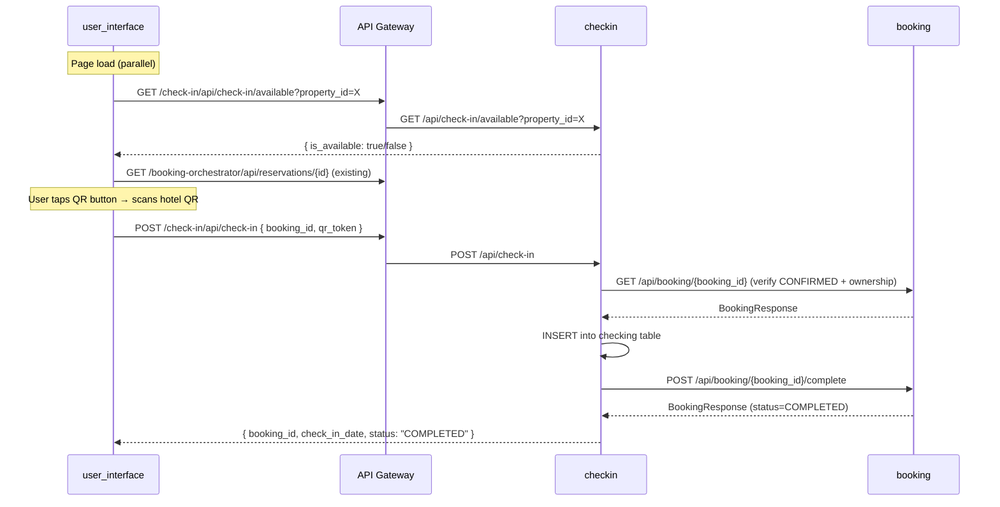

# Feature: Digital Check-In

**Status:** Implemented  
**Created:** 2026-05-02  
**Implemented:** 2026-05-02  
**Author:** Angel Henao  
**Slug:** `digital-checkin`

---

## Summary

Traveler scans a hotel-displayed QR code from the booking detail screen to perform digital check-in. The check-in service validates the QR token against the booking and transitions the reservation to `COMPLETED`. A POC endpoint allows registering properties as QR-enabled without manual DB seeding.

---

## Problem Statement

- **Who is affected?** Travelers with a `CONFIRMED` reservation at a hotel that supports digital check-in.
- **What can't they do today?** There is no way to perform check-in from the app — the booking stays `CONFIRMED` indefinitely after the guest arrives.
- **What does success look like?** A traveler taps the QR "Check In" button in the booking detail, scans the hotel's QR code with their phone camera, and the booking immediately transitions to `COMPLETED`.

---

## Acceptance Criteria

1. [x] `POST /api/check-in/available` registers a property as QR-enabled and returns the generated `qr_token` (string). Subsequent calls for the same `property_id` return a `409 Conflict`.
2. [x] `GET /api/check-in/available?property_id=<uuid>` returns `{ "is_available": true }` when the property is registered and `{ "is_available": false }` otherwise. JWT required.
3. [x] `POST /api/check-in` with a valid `booking_id` (CONFIRMED, owned by the caller) and correct `qr_token` for the booking's property transitions the booking to `COMPLETED`, records a `Checking` row, and returns `{ "booking_id", "check_in_date", "status": "COMPLETED" }`. JWT required.
4. [x] `POST /api/check-in` returns `404` if the booking is not found, `403` if the booking belongs to a different user, `409` if the booking is not in `CONFIRMED` status (including if already `COMPLETED`), and `400` if the `qr_token` does not match the property's registered token.
5. [x] `POST /api/booking/{booking_id}/complete` is a new internal endpoint on the booking service that transitions a `CONFIRMED` booking to `COMPLETED`. Returns `200` with the updated booking. Returns `409` for invalid transitions.
6. [ ] The booking-detail page calls `GET /api/check-in/available?property_id=X` in parallel with the booking fetch on page load. The QR "Check In" button is shown only when the booking is `CONFIRMED` **and** `is_available` is `true`.
7. [ ] Pressing the "Check In" button opens a QR scanner overlay. After a successful scan the app sends `POST /api/check-in`. On success it shows a success alert and navigates to the booking list.
8. [ ] When `is_available` is `false` (hotel has no digital check-in), the QR button is not rendered at all.

---

## Affected Services

| Service | Language | Changes | Notes |
|---|---|---|---|
| `checkin` (new) | Python/FastAPI | New service: 2 DB tables, 3 endpoints, hexagonal arch | Owns `checkin_db` schema |
| `booking` | Python/FastAPI | New `POST /{booking_id}/complete` endpoint + `complete` use case | Calls existing `booking.complete()` domain method |
| `user_interface` | Angular 20 / Ionic 8 | New `CheckInService`, QR scanner overlay, booking-detail changes | Parallel API calls on page load |

---

## API Contracts

### New Endpoints — `checkin` service

#### `POST /api/check-in/available`

**Service:** `checkin`  
**Auth:** Public (POC registration endpoint — no JWT required)  
**Description:** Registers a property as QR-enabled. Generates a random `qr_token` server-side and stores it alongside the `property_id`. For POC use: hotel staff calls this once per property to get the token that goes on the physical QR code.

**Request body:**
```json
{
  "property_id": "uuid — the property to register"
}
```

**Response (201):**
```json
{
  "id": "uuid",
  "property_id": "uuid",
  "qr_token": "string — the generated token (embed this in the hotel's QR code)"
}
```

**Error responses:**
- `409` — property already registered for digital check-in

---

#### `GET /api/check-in/available`

**Service:** `checkin`  
**Auth:** JWT required  
**Description:** Returns whether a property has digital check-in enabled.

**Query params:** `property_id` (UUID, required)

**Response (200):**
```json
{
  "property_id": "uuid",
  "is_available": true
}
```

---

#### `POST /api/check-in`

**Service:** `checkin`  
**Auth:** JWT required (`X-User-Id` injected by API Gateway)  
**Description:** Performs digital check-in. Validates the QR token, verifies the booking is CONFIRMED and belongs to the caller, records the check-in, and calls the booking service to transition the booking to COMPLETED.

**Request body:**
```json
{
  "booking_id": "uuid — the reservation to check in",
  "qr_token": "string — the token read from the hotel's QR code"
}
```

**Response (200):**
```json
{
  "booking_id": "uuid",
  "check_in_date": "YYYY-MM-DD",
  "status": "COMPLETED"
}
```

**Error responses:**
- `400` — `qr_token` does not match the property's registered token
- `403` — booking belongs to a different user
- `404` — booking not found
- `409` — booking is not in `CONFIRMED` status (already COMPLETED, CANCELED, etc.)

---

### New Endpoint — `booking` service

#### `POST /api/booking/{booking_id}/complete`

**Service:** `booking`  
**Auth:** No API Gateway exposure (VPC-internal only — called by `checkin` service)  
**Description:** Transitions a `CONFIRMED` booking to `COMPLETED`. Reuses the existing `Booking.complete()` domain method.

**Response (200):** Full `BookingResponse` (same schema as existing booking endpoints)

**Error responses:**
- `404` — booking not found
- `409` — booking is not in `CONFIRMED` status

---

## Data Model Changes

### `checkin` service — new schema `checkin_db`

#### Table: `checking_available`

| Field | Type | Nullable | Default | Description |
|---|---|---|---|---|
| `id` | `UUID` | No | `gen_random_uuid()` | Primary key |
| `property_id` | `UUID` | No | — | The property registered for digital check-in |
| `qr_token` | `VARCHAR(255)` | No | — | Unique token embedded in the hotel's QR code |

Unique constraint on `property_id`. Unique constraint on `qr_token`.

#### Table: `checking`

| Field | Type | Nullable | Default | Description |
|---|---|---|---|---|
| `id` | `UUID` | No | `gen_random_uuid()` | Primary key |
| `booking_id` | `UUID` | No | — | The booking that was checked in |
| `check_in_date` | `DATE` | No | `CURRENT_DATE` | Date the check-in was performed |

**Migration required:** Yes (new service — tables created on first deploy via SQLAlchemy `create_all` or Alembic)

---

## Cross-Service Communication



---

## Out of Scope

- Admin UI for registering properties in `checking_available` (use the POC `POST /api/check-in/available` endpoint directly)
- Generating or printing physical QR codes for hotels (token is returned by the registration endpoint; embedding in a QR image is done externally)
- Sending a notification event (`CHECKIN_COMPLETED`) to `notifications_queue`
- Time-window restrictions on when the check-in button is available (e.g., only on the check-in date)
- Revoking or rotating QR tokens

---

## Open Questions

| # | Question | Resolution |
|---|---|---|
| 1 | Should `POST /api/check-in` be idempotent? | No — returns 409 because the booking transitions to COMPLETED after first successful check-in; any subsequent call finds a non-CONFIRMED booking and returns 409. |
| 2 | Should the registration endpoint (`POST /api/check-in/available`) require auth in a future version? | Confirmed public for POC. Future hardening: require hotel-admin JWT and validate the caller's admin_group_id matches the property's AdminGroupId. |

---

## Notes

- The `checkin` service calls the `booking` service's new `/complete` endpoint **directly within the VPC** — it does not go through API Gateway. The `BOOKING_SERVICE_URL` SSM parameter (auto-created by `ecs_api` stack as `/{project}/booking/service_url`) is used.
- The booking service's `Booking.complete()` domain method already exists (`booking/src/booking/domain/booking.py:84`) — only the HTTP controller endpoint and use case are missing.
- For QR scanning in the Angular/Capacitor app, use the `html5-qrcode` library (`npm install html5-qrcode`) which works in both the browser and Capacitor WebView without requiring a native plugin.
- The `bookingStatus` label mapping in `booking-detail.page.ts:826` already handles `COMPLETED` → `"Completed"` — no change needed there.

---

## Implementation Notes

- **Frontend ACs deferred (AC-6, AC-7, AC-8):** The `user_interface` changes (QR scanner overlay, conditional check-in button, parallel fetch on booking-detail page load) were not implemented in this sprint. These criteria remain open and are tracked for a follow-up frontend engineer pass.
- **`PerformCheckInUseCase` validation order:** The implementation validates the QR token first (step 1), then fetches the booking (step 2). If the token is invalid the service returns 400 without making an outbound HTTP call to the booking service — this is a minor optimization over the PLAN.md ordering which checked the token as step 1 and also matched the property in step 4, but the behavior is equivalent from the caller's perspective.
- **`POST /api/check-in/available` is public by design:** The endpoint is intentionally excluded from `api_gateway/terraform.tfvars` `public_services` — it is public because it is not listed in the JWT-protected routes. The POC rationale is documented in Open Question 2.
