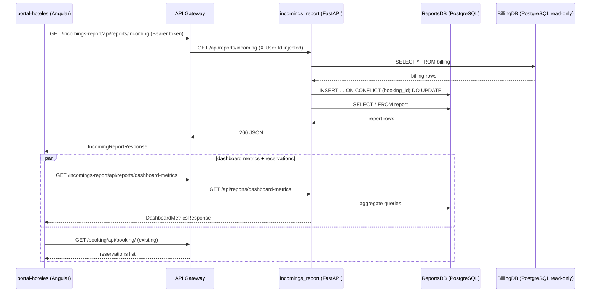

# Technical Plan: Incoming Report & Executive Dashboard Metrics

**Based on:** `specs/incomings-report-dashboard/SPEC.md`  
**Created:** 2026-05-03

---

## Architecture Decisions

1. **New `incomings_report` Python/FastAPI service mirroring the `checkin` service** — same hexagonal layout (`domain/` → `application/` → `infrastructure/` → `controllers.py`), same `uv`/`hatchling` build, same `lifespan`-managed table creation with `create_all`. No divergence from established patterns.

2. **Two SQLAlchemy engines in one service** — `database.py` exports two engines: `reports_engine` (read-write, credentials from `DB_*` SSM params) and `billing_engine` (read-only, credentials from `BILLING_DB_*` SSM params). This separates session factories cleanly and avoids accidental writes to BillingDB.

3. **Upsert-on-read via `booking_id` unique constraint** — `GET /api/reports/incoming` syncs billing data into ReportsDB on every call using PostgreSQL `INSERT … ON CONFLICT (booking_id) DO UPDATE`. Idempotent, no background job needed for POC.

4. **Separate `BillingModel` ORM class mapped to BillingDB's `billing` table** — declared against `billing_engine`'s `Base` with `__table_args__ = {'schema': None}` so it doesn't interfere with the reports schema. Fields mirror `BillingEntity.java` exactly.

5. **CSV streamed via `StreamingResponse`** — avoids buffering the full file in memory. Uses `io.StringIO` with `csv.writer` yielded line-by-line. UTF-8 BOM prepended for Excel compatibility.

6. **Frontend: new `ReportsService` in shared core** — placed at `user_interface/src/app/core/services/reports.service.ts` so it can be imported by both portal-hoteles pages. Uses `HttpClient` with `Observable`, matching the existing `BookingService` pattern. The `reports.page.ts` switches from `ChangeDetectionStrategy.OnPush` with static data to constructor-injected service + `ionViewWillEnter()` lifecycle hook (same pattern as `dashboard.page.ts`).

7. **SSM secrets layout for Terraform** — `incomings-report` gets `create_database = true` (own ReportsDB at `/final-project-miso/incomings-report/db_*`) plus four additional secrets pointing to `/final-project-miso/billing/db_*` for read-only BillingDB access (named `BILLING_DB_*` to avoid collision).

---

## Service Breakdown

---

### `incomings_report` (Python / FastAPI / hexagonal) — NEW SERVICE

**Pattern:** Hexagonal — same structure as `checkin`. Two DB engines: own ReportsDB (write) + BillingDB (read-only).

**Files to create:**
```
services/incomings_report/
├── main.py                                      # uvicorn entry: re-exports app from package
├── pyproject.toml                               # uv/hatchling, same deps as checkin
├── Dockerfile                                   # FROM python:3.13-slim, port 80
├── .env.example                                 # local dev env vars
└── src/incomings_report/
    ├── __init__.py
    ├── main.py                                  # create_app() + lifespan (create_all on reports engine)
    ├── controllers.py                           # APIRouter prefix="/api/reports" — 4 endpoints
    ├── schemas.py                               # Pydantic models: ReportRecord, IncomingReportResponse,
    │                                            #   RevenueOverviewResponse, DashboardMetricsResponse
    ├── config.py                                # Settings(BaseSettings): DB_*, BILLING_DB_*, APP_NAME
    ├── database.py                              # reports_engine + billing_engine + two session factories
    ├── bootstrap.py                             # get_report_repository(), use case factory functions
    ├── domain/
    │   ├── __init__.py
    │   ├── entities.py                          # ReportRecord dataclass (id, booking_id, gross_value,
    │   │                                        #   taxes, commission, net_income, payment_date, status)
    │   └── exceptions.py                        # (empty for now; kept for consistency)
    ├── application/
    │   ├── __init__.py
    │   ├── ports.py                             # ReportRepository ABC with abstract methods
    │   ├── commands.py                          # Query/Command dataclasses (GetIncomingReportQuery,
    │   │                                        #   GetRevenueOverviewQuery, GetDashboardMetricsQuery)
    │   ├── sync_and_get_report.py               # SyncAndGetReportUseCase: reads billing → upserts →
    │   │                                        #   returns list. Applies TAX_RATE=0.075, COMMISSION_RATE=0.05
    │   ├── get_revenue_overview.py              # GetRevenueOverviewUseCase: GROUP BY month/year
    │   ├── get_dashboard_metrics.py             # GetDashboardMetricsUseCase: KPI aggregation
    │   └── get_csv_report.py                    # GetCsvReportUseCase: yields CSV rows as generator
    └── infrastructure/
        ├── __init__.py
        ├── models.py                            # ReportModel (reports engine Base) — maps report table
        ├── billing_models.py                    # BillingModel (billing engine Base) — maps billing table
        │                                        #   read-only; no create_all called on billing engine
        └── sqlalchemy_report_repo.py            # SqlAlchemyReportRepository implements ReportRepository:
                                                 #   - upsert_from_billing(billing_records) → List[ReportRecord]
                                                 #   - get_all(start_date, end_date) → List[ReportRecord]
                                                 #   - get_revenue_overview(months) → List[dict]
                                                 #   - get_dashboard_metrics() → dict
```

**Key implementation notes:**

`config.py` — Settings fields:
```python
# Own DB (ReportsDB)
DB_USERNAME: str = "postgres"
DB_PASSWORD: str = "postgres"
DB_HOST: str = "localhost"
DB_PORT: int = 5432
DB_NAME: str = "incomings_report"

# BillingDB (read-only)
BILLING_DB_USERNAME: str = "postgres"
BILLING_DB_PASSWORD: str = "postgres"
BILLING_DB_HOST: str = "localhost"
BILLING_DB_PORT: int = 5432
BILLING_DB_NAME: str = "billing"

# Financial constants
TAX_RATE: float = 0.075
COMMISSION_RATE: float = 0.05
```

`database.py` — two engines:
```python
reports_engine = create_async_engine(settings.database_url, ...)
billing_engine  = create_async_engine(settings.billing_database_url, ...)

reports_session_factory = async_sessionmaker(reports_engine, ...)
billing_session_factory  = async_sessionmaker(billing_engine, ...)

class ReportsBase(DeclarativeBase): pass
class BillingBase(DeclarativeBase): pass
```

`infrastructure/billing_models.py` — maps BillingDB.billing exactly as in BillingEntity.java:
```python
class BillingModel(BillingBase):
    __tablename__ = "billing"
    id: Mapped[str]              # VARCHAR PK
    booking_id: Mapped[str]
    payment_date: Mapped[datetime | None]
    update_date: Mapped[datetime | None]
    payment_reference: Mapped[str | None]
    admin_group_id: Mapped[str | None]
    value: Mapped[Decimal | None]
    state: Mapped[str | None]    # plain string, e.g. "CONFIRMED", "CANCELLED"
    reason: Mapped[str | None]
```

`infrastructure/models.py` — ReportModel:
```python
class ReportModel(ReportsBase):
    __tablename__ = "report"
    id: Mapped[UUID]             # gen_random_uuid() default
    booking_id: Mapped[str]      # unique constraint for upsert
    payment_reference: Mapped[str | None]
    payment_date: Mapped[date | None]
    update_date: Mapped[date | None]
    admin_group_id: Mapped[str | None]
    gross_value: Mapped[Decimal]
    taxes: Mapped[Decimal]
    commission: Mapped[Decimal]
    net_income: Mapped[Decimal]
    status: Mapped[str | None]
    created_at: Mapped[datetime]  # server_default=func.now()
```

`application/sync_and_get_report.py` — core logic:
```python
async def execute(query: GetIncomingReportQuery) -> IncomingReportResult:
    billing_records = await self.repo.get_all_billing(
        start_date=query.start_date,
        end_date=query.end_date,
    )
    report_records = self._compute_financials(billing_records)
    await self.repo.upsert_reports(report_records)
    all_reports = await self.repo.get_all_reports(query.start_date, query.end_date)
    return IncomingReportResult(records=all_reports, ...)

def _compute_financials(self, billing_records):
    for b in billing_records:
        gross = b.value or Decimal("0")
        taxes = (gross * Decimal(str(settings.TAX_RATE))).quantize(Decimal("0.01"))
        commission = (gross * Decimal(str(settings.COMMISSION_RATE))).quantize(Decimal("0.01"))
        net_income = gross - taxes - commission
        yield ReportRecord(booking_id=b.booking_id, gross_value=gross, ...)
```

**controllers.py** — 4 endpoints:
```python
router = APIRouter(prefix="/api/reports", tags=["reports"])

@router.get("/incoming")           # → SyncAndGetReportUseCase
@router.get("/revenue-overview")   # → GetRevenueOverviewUseCase
@router.get("/dashboard-metrics")  # → GetDashboardMetricsUseCase
@router.get("/incoming/csv")       # → GetCsvReportUseCase, returns StreamingResponse
```

All endpoints declare `x_user_id: str = Header(..., alias="X-User-Id")` to enforce JWT presence (returns 422 automatically if missing; API Gateway prevents unauthenticated requests from reaching the service).

**DB migration:** Tables created automatically at startup via `Base.metadata.create_all` on `reports_engine` only. BillingDB tables are never touched by `create_all` (only `BillingBase` registered against `billing_engine`; `lifespan` does not call `create_all` on `billing_engine`).

---

## Interface Contracts

### Service-to-service calls

No inter-service HTTP calls — `incomings_report` reads BillingDB directly via SQLAlchemy.

### New API paths via API Gateway

| Frontend | API Gateway route | Service |
|---|---|---|
| `GET /incomings-report/api/reports/incoming` | → `incomings-report` ECS | JWT required |
| `GET /incomings-report/api/reports/revenue-overview` | → `incomings-report` ECS | JWT required |
| `GET /incomings-report/api/reports/dashboard-metrics` | → `incomings-report` ECS | JWT required |
| `GET /incomings-report/api/reports/incoming/csv` | → `incomings-report` ECS | JWT required |

### New domain events

None — this service is read-only with respect to SQS.

---

## Cross-Service Dependency Diagram



---

## Infrastructure Changes

### `terraform/environments/develop/ecs_api/terraform.tfvars`

Add new service block:
```hcl
"incomings-report" = {
  ecr_repository_name       = "api_incomings_report"
  container_name            = "api_incomings_report"
  ecs_task_size             = { cpu = 256, memory = 512 }
  create_database           = true
  desired_count_tasks       = 1
  placement_constraint_type = ""
  autoscaling = {
    max_capacity = 1
    min_capacity = 1
  }
  health_check = {
    path = "/api/health"
  }
  secrets = [
    { name = "DB_USERNAME",          valueFrom = "/final-project-miso/incomings-report/db_username" },
    { name = "DB_PASSWORD",          valueFrom = "/final-project-miso/incomings-report/db_password" },
    { name = "DB_HOST",              valueFrom = "/final-project-miso/incomings-report/db_host" },
    { name = "DB_NAME",              valueFrom = "/final-project-miso/incomings-report/db_name" },
    { name = "BILLING_DB_USERNAME",  valueFrom = "/final-project-miso/billing/db_username" },
    { name = "BILLING_DB_PASSWORD",  valueFrom = "/final-project-miso/billing/db_password" },
    { name = "BILLING_DB_HOST",      valueFrom = "/final-project-miso/billing/db_host" },
    { name = "BILLING_DB_NAME",      valueFrom = "/final-project-miso/billing/db_name" }
  ]
}
```

### `terraform/environments/develop/container_registry/terraform.tfvars`

Add `"api_incomings_report"` to the ECR repository list.

### `terraform/environments/develop/api_gateway/terraform.tfvars`

Add `"incomings-report"` to the `service_names` list.

### `.github/workflows/deploy_apps.yml`

Add `incomings-report` to:
- `test` job matrix (`language: python`, `dir: services/incomings_report`)
- `build_and_push` job matrix (`language: python`)

---

## Risk Flags

- **BillingDB network access from ECS** — The `incomings_report` service connects to BillingDB directly. Both services share the same RDS instance (different databases/schemas). The `incomings-report` ECS task needs the same security group access to RDS as the billing service. No extra SG changes needed if they share the ECS cluster SG.

- **BillingDB SSM params referenced before billing is deployed** — If `billing` service hasn't been deployed yet, `/final-project-miso/billing/db_*` SSM params won't exist. The existing split-SSM fix in `ecs_api/main.tf` handles this: these are `external_secret_param_paths` so they're looked up by data source. Deploy billing first.

- **`state` field in BillingDB is a plain string** — Confirmed from `BillingEntity.java`. No join to `billing_state` table needed. SPEC.md Open Question #1 is resolved.

- **CSV download and CORS** — The API Gateway must allow `Content-Disposition` response headers to pass through. Existing wildcard CORS configuration (`allow_headers=["*"]`) in FastAPI covers this for the service side; verify API Gateway integration doesn't strip it.

---

## Implementation Order

1. `services/incomings_report/` — backend service (no external dependencies; builds and tests against local postgres)
2. Terraform + CI/CD — add service to infra and pipeline
