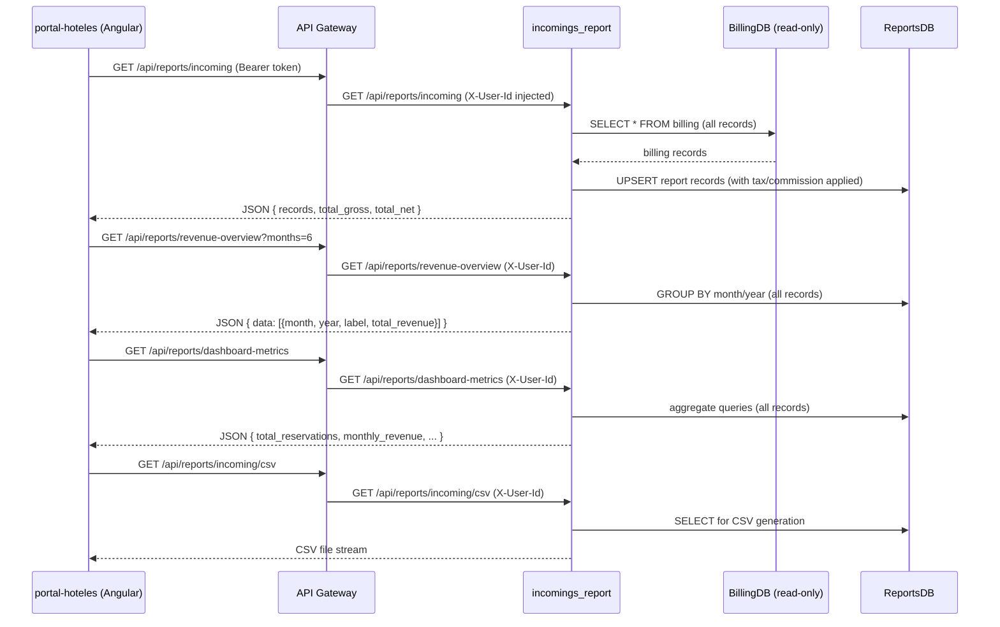

# Feature: Incoming Report & Executive Dashboard Metrics

**Status:** Implemented  
**Created:** 2026-05-03  
**Implemented:** 2026-05-03  
**Author:** Angel Henao  
**Slug:** `incomings-report-dashboard`

---

## Summary

A new `incomings_report` Python/FastAPI microservice that fetches billing data directly from BillingDB, persists financial records to its own ReportsDB, and exposes endpoints for per-booking revenue breakdowns (CSV download), monthly revenue aggregation (chart), and executive KPI metrics (dashboard cards). The existing portal-hoteles frontend pages (Reports and Dashboard) are wired to consume real data from these endpoints.

---

## Problem Statement

- **Who is affected:** Hotel managers (`hotel-admins` role) using the Portal Hoteles web app.
- **What can't they do today:** The Reports page shows 100% hardcoded static data. The Dashboard KPI cards (Total Reservations, Monthly Revenue, Today's Check-ins) are also static. No real financial data is accessible.
- **What success looks like:** A hotel manager logs in, navigates to Reports, sees real revenue figures pulled from actual billing records, can download a CSV per booking period, and the Dashboard cards reflect live aggregated metrics.

---

## Acceptance Criteria

1. [x] `GET /api/reports/incoming` returns a list of all report records (no hotel-scoping — the portal represents one unified hotel), each including: `booking_id`, `payment_reference`, `gross_value`, `taxes`, `commission`, `net_income`, `payment_date`, `status`.
2. [x] On the first call (or refresh), the service reads **all** billing records from BillingDB, upserts them into ReportsDB applying the 7.5% tax and 5% commission formula, and returns the enriched records.
3. [x] `GET /api/reports/revenue-overview?months=N` returns a JSON array of `{ month, year, total_revenue }` objects covering the last N months (default 6), suitable for direct use as a bar chart data source.
4. [x] `GET /api/reports/dashboard-metrics` returns a JSON object with: `total_reservations`, `monthly_revenue`, `avg_daily_revenue`, `revenue_trend_pct` (percentage change vs. previous month).
5. [x] `GET /api/reports/incoming/csv` streams a UTF-8 CSV file (with BOM for Excel compatibility) with columns: Date, Booking Code, Gross Rate, Taxes, TravelHub Commission, Net Income, Status.
6. [x] All endpoints require JWT (`hotel-admins` role). Requests without a valid `X-User-Id` header return `401`.
7. [x] The revenue-overview endpoint responds in under 2 seconds (p95) for up to 12 months of data.
8. [x] Unit test coverage ≥ 80% on all new `incomings_report` service code (domain, application, infrastructure layers).

---

## Affected Services

| Service | Language | Changes | Notes |
|---|---|---|---|
| `incomings_report` | Python/FastAPI | **New service** — 4 endpoints, ReportsDB, reads BillingDB | Hexagonal arch, same pattern as `checkin` |

---

## API Contracts

### New Endpoints

#### `GET /api/reports/incoming`

**Service:** `incomings_report`  
**Auth:** JWT required (presence of `X-User-Id` header confirms authenticated hotel-admin)  
**Description:** Fetches all billing records from BillingDB, upserts enriched records into ReportsDB, and returns the full list. No hotel-scoping — the portal treats all data as one unified hotel.

**Query params:**
- `start_date` (optional, ISO date) — filter records from this date
- `end_date` (optional, ISO date) — filter records up to this date

**Response (200):**
```json
{
  "records": [
    {
      "id": "uuid",
      "booking_id": "uuid",
      "payment_reference": "string",
      "payment_date": "YYYY-MM-DD",
      "gross_value": 1000.00,
      "taxes": 75.00,
      "commission": 50.00,
      "net_income": 875.00,
      "status": "string"
    }
  ],
  "total_records": 42,
  "total_gross": 42000.00,
  "total_net": 36750.00
}
```

**Error responses:**
- `401` — Missing or invalid `X-User-Id` header

---

#### `GET /api/reports/revenue-overview`

**Service:** `incomings_report`  
**Auth:** JWT required  
**Description:** Returns monthly aggregated gross revenue for the last N months, for use as a bar chart data source.

**Query params:**
- `months` (optional, int, default 6) — number of past months to include

**Response (200):**
```json
{
  "data": [
    { "month": 1, "year": 2026, "label": "Jan", "total_revenue": 89240.00 },
    { "month": 2, "year": 2026, "label": "Feb", "total_revenue": 74120.50 }
  ]
}
```

---

#### `GET /api/reports/dashboard-metrics`

**Service:** `incomings_report`  
**Auth:** JWT required  
**Description:** Returns executive KPI metrics for the hotel admin's dashboard cards.

**Response (200):**
```json
{
  "total_reservations": 247,
  "monthly_revenue": 89240.00,
  "avg_daily_revenue": 2975.33,
  "revenue_trend_pct": 43.0,
  "today_checkins": 28,
  "today_checkouts": 22
}
```

**Notes:** `today_checkins` and `today_checkouts` are derived from ReportsDB `payment_date`. `revenue_trend_pct` = (current month revenue − previous month revenue) / previous month revenue × 100.

---

#### `GET /api/reports/incoming/csv`

**Service:** `incomings_report`  
**Auth:** JWT required  
**Description:** Streams a UTF-8 CSV file (with BOM) with per-booking financial breakdown.

**Query params:** same as `GET /api/reports/incoming` (`start_date`, `end_date`)

**Response headers:**
```
Content-Type: text/csv; charset=utf-8
Content-Disposition: attachment; filename="revenue_report_YYYY-MM-DD.csv"
```

**CSV columns:** Date, Booking Code, Gross Rate, Taxes (7.5%), TravelHub Commission (5%), Net Income, Status

**Error responses:**
- `401` — Missing or invalid `X-User-Id` header

---

## Data Model Changes

### `incomings_report` — `report` table (new schema: `reports`)

| Field | Type | Nullable | Default | Description |
|---|---|---|---|---|
| `id` | UUID | No | gen_random_uuid() | Primary key |
| `booking_id` | UUID | No | — | FK reference to billing record |
| `payment_reference` | VARCHAR(255) | Yes | NULL | Payment reference string from billing |
| `payment_date` | DATE | Yes | NULL | Date of payment |
| `update_date` | DATE | Yes | NULL | Last update from billing |
| `admin_group_id` | UUID | Yes | NULL | Stored as-is from BillingDB for reference; not used for filtering |
| `gross_value` | DECIMAL(12,2) | No | — | Raw billing value |
| `taxes` | DECIMAL(12,2) | No | — | 7.5% of gross_value |
| `commission` | DECIMAL(12,2) | No | — | 5% of gross_value |
| `net_income` | DECIMAL(12,2) | No | — | gross_value − taxes − commission |
| `status` | VARCHAR(50) | Yes | NULL | Billing state (from BillingDB) |
| `created_at` | TIMESTAMP | No | now() | Record creation time |

**Migration required:** Yes (Alembic, auto-generated)

### BillingDB read model (no schema changes)

The service reads the `billing` table from the BillingDB schema using a **read-only** SQLAlchemy connection. Fields consumed:

| Field | Type | Used for |
|---|---|---|
| `id` | UUID | Report `booking_id` source linkage |
| `booking_id` | UUID | `report.booking_id` |
| `payment_date` | DATE | `report.payment_date` |
| `update_date` | DATE | `report.update_date` |
| `payment_reference` | VARCHAR | `report.payment_reference` |
| `admin_group_id` | UUID | Stored for reference only (not used as a filter) |
| `value` | DECIMAL | `report.gross_value` |
| `state` | (FK/VARCHAR) | `report.status` (joined with billing_state) |

---

## Cross-Service Communication



---

## Out of Scope

- PDF export (only CSV is implemented)
- Real-time streaming or WebSocket updates
- Changes to the `billing` microservice (no new REST endpoints, no code changes)
- Occupancy rate calculation (no room inventory data available in this POC)
- Multi-currency conversion (all values returned in the currency stored in BillingDB)
- Avg. Rating and Return Rate metrics shown in the dashboard Quick Stats sidebar (no rating data exists)
- The `billing_queue` SQS flow — `incomings_report` does not consume or produce SQS messages

---

## Open Questions

| # | Question | Resolution |
|---|---|---|
| 1 | BillingDB `state` field is a FK to `billing_state` table — does the `incomings_report` service join this table or store the raw state ID? | BillingEntity.java confirmed `state` is a plain String — no JOIN needed. BillingModel maps it directly as a String column. |
| 2 | Today's check-ins/check-outs: should these come from the booking service instead of ReportsDB, since ReportsDB only tracks payments? | For POC, derived from payment_date (check-ins) and update_date (check-outs) in ReportsDB. |

---

## Notes

- **Tax & commission constants** are hardcoded at the service level: `TAX_RATE = 0.075`, `COMMISSION_RATE = 0.05`. These match the breakdown already shown in the `dashboard-reservation` page UI.
- **No hotel-scoping in the POC.** All billing records are treated as belonging to one unified hotel. The authenticated `hotel-admin` role (verified via JWT / `X-User-Id` presence) is sufficient authorization — no per-hotel data isolation is applied.
- **BillingDB read-only access** is a POC shortcut. In production, inter-service data sharing should go via an API or event stream. The billing service's SSM DB credentials will be reused under a read-only IAM-level restriction.
- **Upsert behavior** on `GET /api/reports/incoming`: if a billing record has already been stored in ReportsDB (`booking_id` unique constraint), it is updated (not duplicated). This ensures idempotent refreshes.
- The `incomings_report` service follows the same hexagonal architecture pattern as `checkin` and `booking`: `domain/` → `application/` → `infrastructure/` → `controllers.py`.
- The portal-hoteles frontend already has all the UI components (KPI cards, chart, table, CSV button) — only the data wiring (service calls + TypeScript models) needs to be added.

---

## Implementation Notes

- **BillingDB `state` field (Q1):** The spec anticipated a FK join against `billing_state`. The actual BillingDB schema stores `state` as a plain `VARCHAR` column on the `billing` table. `BillingModel` maps it directly as a `String` — no join is performed.
- **Today's check-ins/check-outs (Q2):** `dashboard-metrics` derives `today_checkins` from rows whose `payment_date` equals today and `today_checkouts` from rows whose `update_date` equals today, both sourced from ReportsDB. No call is made to the booking service.
- **`dashboard-metrics` response shape:** The spec listed `today_checkins` and `today_checkouts` in the response. These are included in the final implementation exactly as specced.
- **Two SQLAlchemy engines:** The service uses `ReportsBase` (read-write) and `BillingBase` (read-only, no `create_all`) — both managed by `database.py` and wired through `bootstrap.py`. No HTTP calls to the billing service are made at any point.
