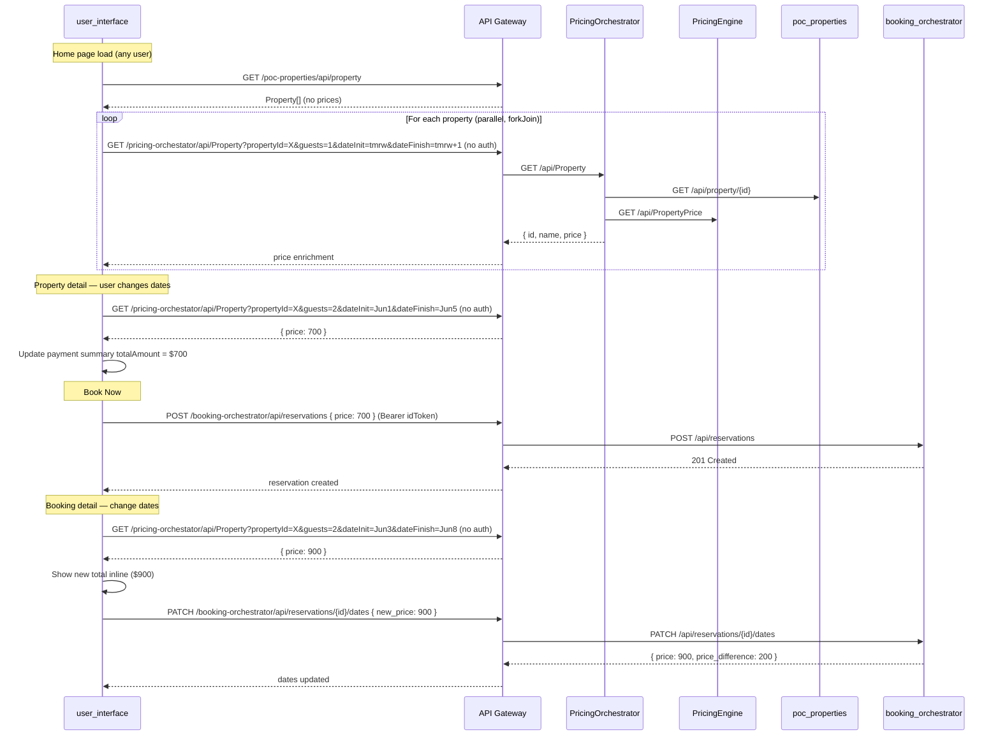

# Technical Plan: Pricing Integration — Real Prices Across Property Discovery and Booking

**Based on:** `specs/pricing-integration/SPEC.md`  
**Created:** 2026-04-24

---

## Architecture Decisions

1. **New `PricingService` rather than extending `PlatformApiService`** — `PlatformApiService` (lines 13–90 of `platform-api.service.ts`) is a catch-all utility that sends **no** `Authorization` header (its `defaultHeaders` only includes `Content-Type`). Every other page-facing service (`BookingService`, `HotelsService`) manages its own auth headers per-method. Creating a focused `PricingService` follows this established pattern and avoids coupling page-level auth logic into a shared utility. The existing `PlatformApiService.getPricingOrchestratorProperty()` stays untouched.

2. **New `pricing.model.ts` alongside existing `platform-api.model.ts`** — The existing `PricingPropertyResponse` (5 optional fields: `id?, name?, city?, country?, price?`) doesn't match the actual PricingOrchestrator response (9 fields, only `price` is used). A dedicated model file keeps the typing accurate. We re-export `PropertyPriceQuery` from `platform-api.model.ts` since it already matches the query parameters exactly — no duplication needed.

3. **No auth required for pricing (resolves Open Question #3)** — PricingEngine and PricingOrchestrator are public services (no JWT required). `PricingService` sends no `Authorization` header. All users — authenticated or not — get real prices on every page. No auth-gating logic needed.

4. **`switchMap` reactive pricing on date changes** — Both `propertydetail.page` and `booking-detail.page` use a `Subject` that emits when check-in, check-out, or guests change. A `switchMap` pipeline cancels in-flight requests on rapid changes, preventing race conditions and stale-price display.

5. **Disable "Book Now" until a valid price is fetched (resolves Open Question #2)** — `propertydetail.page` tracks `priceForStay: number | null = null`. The action button is disabled when `priceForStay` is `null` (no dates selected yet) or when a pricing call is in flight. `onBookNow()` refuses to submit if `priceForStay` is `null`.

6. **Keep `$0` during loading on listing page (resolves Open Question #1)** — No shimmer component is added. Hotels render with `$0` from the property API, then update in-place once pricing resolves. Failed individual pricing calls fall back to `0` silently.

7. **Preview price before submitting on booking-detail (resolves hardcoded `new_price: 0`)** — `booking-detail.page` tracks `previewedNewPrice: number | null`. When both dates are set and changed, PricingOrchestrator is called automatically. The payment summary shows the new total inline. `onRecalculatePrice()` submits `previewedNewPrice` instead of `0`.

---

## Service Breakdown

### `user_interface` (Angular 20 / Ionic 8 / TypeScript)

**Pattern:** Service injection, lazy-loaded pages, Ionic components. No HTTP interceptor — each service manages its own headers.

**Files to create:**

```
user_interface/src/app/core/models/pricing.model.ts
  — PricingOrchestratorResponse interface (id, name, maxCapacity, description,
    urlBucketPhotos, checkInTime, checkOutTime, adminGroupId, price)
  — Re-export PropertyPriceQuery from platform-api.model.ts

user_interface/src/app/core/services/pricing.service.ts
  — Injectable service: getPropertyWithPrice(params) → Observable<PricingOrchestratorResponse>
  — Builds URL from ConfigService.pricingOrchestratorApiPath
  — No Authorization header needed (public endpoint)
```

**Files to modify:**

```
user_interface/src/app/core/services/config.service.ts
  — Add pricingOrchestratorApiPath to AppConfig interface (line 5)
  — Add default '/pricing-orchestator/api/Property' in config initializer (line 15)
  — Add getter with fallback (after line 49)

user_interface/src/assets/config.json
  — Add "pricingOrchestratorApiPath": "/pricing-orchestator/api/Property"

user_interface/src/app/core/services/hotels.service.ts
  — Inject PricingService
  — Add enrichWithPricing(hotels) method: forkJoin of PricingService calls
    for each hotel (guests=1, dateInit=tomorrow, dateFinish=day-after-tomorrow)
  — Add getHotelsWithPricing(params?) method: pipes getHotels() → switchMap → enrichWithPricing()
  — Individual pricing failures fall back to 0 via catchError

user_interface/src/app/pages/propertydetail/propertydetail.page.ts
  — Import PricingService, Subject, switchMap, takeUntil, OnDestroy
  — Add priceForStay: number | null = null (tracks PricingOrchestrator total price)
  — Add isPricingLoading = false
  — Add pricingError = ''
  — Add private priceTrigger$ = new Subject<{propertyId, guests, checkIn, checkOut}>()
  — In constructor: inject PricingService
  — In ngOnInit or constructor: set up priceTrigger$.pipe(switchMap → pricingService.getPropertyWithPrice())
    that updates priceForStay, isPricingLoading, pricingError
  — In onCheckInChanged / onCheckOutChanged / onGuestsChanged: emit to priceTrigger$ when both
    dates are set and property ID is known
  — In onBookNow() line 280: change `price: this.nightlyPrice` → `price: this.priceForStay ?? 0`
  — In updatePaymentSummary(): when priceForStay is set, use it for totalAmount instead of
    nightlyPrice * nights

user_interface/src/app/pages/propertydetail/propertydetail.page.html
  — Add [actionDisabled] binding: disabled when priceForStay is null or isPricingLoading
  — Add [isLoading] binding on payment summary when isPricingLoading is true
  — Show pricingError message if set (inline text below payment summary or as footnote)

user_interface/src/app/pages/booking-detail/booking-detail.page.ts
  — Import PricingService, Subject, switchMap, takeUntil, OnDestroy
  — Add previewedNewPrice: number | null = null
  — Add isPricingLoading = false
  — Add pricingError = ''
  — Add private priceTrigger$ = new Subject<{propertyId, guests, checkIn, checkOut}>()
  — In constructor: inject PricingService (add to imports array for standalone component)
  — Set up switchMap pipeline same as propertydetail
  — In onCheckInChanged / onCheckOutChanged / onGuestsChanged: emit to priceTrigger$ when both
    dates are set and currentReservation.property_id is known
  — When pricing resolves: update paymentSummary.totalAmount and summaryItems inline
  — In onRecalculatePrice() line 446: change `new_price: 0` → `new_price: this.previewedNewPrice ?? 0`

user_interface/src/app/pages/home/home.page.ts
  — In loadHotels(): call hotelsService.getHotelsWithPricing() instead of hotelsService.getHotels()
  — In onSearchHotels(): same — use getHotelsWithPricing(params) instead of getHotels(params)
  — No auth changes needed (pricing is public)
```

**DB migration:** None

---

### CI/CD Workflows + Terraform

Both .NET pricing services are **missing from CI test matrices** and `pricing-orchestator` is scaled to zero.

**Current state:**
- `deploy_apps.yml` `build_and_push` matrix: includes both .NET services ✅
- `deploy_apps.yml` `test` matrix: .NET services NOT included ❌ (built without testing)
- `pr_validation.yml` `test` matrix: .NET services NOT included ❌
- `pr_validation.yml` `build_and_push` matrix: .NET services NOT included ❌
- No `.github/actions/test-dotnet/` action exists ❌ (test-python, test-java, test-angular exist)
- `ecs_api/terraform.tfvars`: `pricing-orchestator` has `desired_count_tasks = 0` ❌

**.NET test infrastructure:**
- Both test projects have `coverlet.collector` 8.0.0 — coverage is possible via `dotnet test --collect:"XPlat Code Coverage"`
- NUnit + NSubstitute framework
- Only 1 test file each (`PricingServiceTests.cs`, `PropertyControllerTests.cs`) — coverage is likely below 80%

**Files to create:**

```
.github/actions/test-dotnet/action.yml
  — Composite action: setup .NET 8, dotnet restore, dotnet test with coverage collection
  — Inputs: context-path (required)
  — Pattern: same as test-python/test-java actions
```

**Files to modify:**

```
.github/workflows/pr_validation.yml
  — Add pricing-engine and pricing-orchestator to test matrix (language: dotnet)
  — Add pricing-engine and pricing-orchestator to build_and_push matrix (language: dotnet)
  — Add dotnet test step (if: matrix.language == 'dotnet') using test-dotnet action

.github/workflows/deploy_apps.yml
  — Add pricing-engine and pricing-orchestator to test matrix (language: dotnet)
  — Add dotnet test step (if: matrix.language == 'dotnet') using test-dotnet action

terraform/environments/develop/ecs_api/terraform.tfvars
  — Change pricing-orchestator desired_count_tasks from 0 to 1
  — Change pricing-orchestator autoscaling min_capacity from 0 to 1
```

---

### Postman Collection (YAML git-local)

**Pattern:** Each request is a `.request.yaml` file in a named folder under `postman/postman/collections/travelhub-backend/`. Requests use `{{base_url}}` and `{{id_token}}` collection variables.

**Files to create:**

```
postman/postman/collections/travelhub-backend/Pricing Engine/01 - Get Property Price.request.yaml
  — GET {{base_url}}/pricing-engine/api/PropertyPrice?propertyId={{property_id}}&guests=2&dateInit=2026-06-01&dateFinish=2026-06-03
  — No auth required (public endpoint)
  — Tests: 200 status, response has 'price' field, price is a number

postman/postman/collections/travelhub-backend/Pricing Engine/02 - Health Check.request.yaml
  — GET {{base_url}}/pricing-engine/api/Health
  — Tests: 200 status

postman/postman/collections/travelhub-backend/Pricing Orchestrator/01 - Get Property With Price.request.yaml
  — GET {{base_url}}/pricing-orchestator/api/Property?propertyId={{property_id}}&guests=2&dateInit=2026-06-01&dateFinish=2026-06-03
  — No auth required (public endpoint)
  — Tests: 200 status, response has 'price' and 'name' fields, price is a number

postman/postman/collections/travelhub-backend/Pricing Orchestrator/02 - Health Check.request.yaml
  — GET {{base_url}}/pricing-orchestator/api/Health
  — Tests: 200 status
```

**Files to modify:**

```
postman/postman/collections/travelhub-backend/collection.yaml
  — Update description to list pricing-engine and pricing-orchestator as services
```

---

## Interface Contracts

### Frontend → API Gateway calls (new)

| Caller | Target | Method | Path | Auth | Notes |
|---|---|---|---|---|---|
| `PricingService` | PricingOrchestrator | GET | `/pricing-orchestator/api/Property?propertyId=&guests=&dateInit=&dateFinish=` | None (public) | Used by property detail, booking detail, and hotel listing enrichment |

### Existing calls used (not modified)

| Caller | Target | Method | Path | Notes |
|---|---|---|---|---|
| `HotelsService` | poc-properties | GET | `/poc-properties/api/property` | Returns property list without prices |
| `BookingService` | booking-orchestrator | POST | `/booking-orchestrator/api/reservations` | `price` field in body now comes from PricingOrchestrator |
| `BookingService` | booking-orchestrator | PATCH | `/booking-orchestrator/api/reservations/{id}/dates` | `new_price` field in body now comes from PricingOrchestrator |

### No new domain events

This feature is frontend-only. No new SQS events.

---

## Cross-Service Dependency Diagram



---

## Risk Flags

- **N+1 pricing calls on listing page** — The home page fires one PricingOrchestrator call per property (typically 10–20). Each call triggers PricingOrchestrator → poc-properties + PricingEngine (3 HTTP hops). Mitigation: use `forkJoin` so calls are parallel; individual failures fall back to `$0` via `catchError`; listing page pricing is best-effort (not blocking). A batch endpoint could be added later.

- **Pricing endpoints are public** — No JWT needed, so all users get real prices. If these endpoints are ever locked down behind auth, the `PricingService` will need an `accessToken` parameter and `HotelsService`/pages will need to pass it.

- **Race conditions on rapid date changes** — A user clicking through dates quickly could get stale pricing responses. Mitigation: `switchMap` auto-cancels previous in-flight requests; only the latest response updates the UI.

- **PricingOrchestrator path has a typo: `pricing-orchestator`** — The deployed service and API Gateway route use this spelling (missing an 'r'). All URLs must use the typo'd spelling to match the deployed route. The config default and Postman requests must match.

- **`priceForStay` vs `nightlyPrice` semantic shift** — PricingOrchestrator returns a **total** price for the stay, not a per-night rate. The property detail page currently multiplies `nightlyPrice × nights` for the total. With pricing integration, the total comes directly from PricingOrchestrator. The `title` (displayed as "$X per night") should still show the per-night rate (total / nights), but `totalAmount` should show the PricingOrchestrator total directly.

- **No CI testing for .NET services** — Neither `pr_validation.yml` nor `deploy_apps.yml` run `dotnet test` for pricing services. A `test-dotnet` action must be created and both workflows updated. Without this, regressions in pricing backends go undetected.

- **`pricing-orchestator` is scaled to zero** — `desired_count_tasks = 0` and `min_capacity = 0` in `ecs_api/terraform.tfvars`. The frontend will get 5xx errors if this isn't set to 1 before the feature ships.

- **.NET test coverage likely below 80%** — Both test projects have only 1 test file each. `coverlet.collector` is installed but never wired into CI. The 80% coverage target for this feature applies to the **new Angular code**; .NET backend coverage is a pre-existing gap, not gated on this feature.

---

## Implementation Order

Recommended sequence to minimize blocking:

1. **Config + Model + Service** — `config.service.ts`, `config.json`, `pricing.model.ts`, `pricing.service.ts` (no dependencies)
2. **Hotels enrichment** — `hotels.service.ts` + `home.page.ts` (depends on step 1)
3. **Property detail pricing** — `propertydetail.page.ts` + `.html` (depends on step 1)
4. **Booking detail pricing** — `booking-detail.page.ts` (depends on step 1)
5. **CI/CD + Terraform + Postman** — Create `test-dotnet` action, update workflows, set pricing-orchestator desired_count_tasks=1, create Postman folders
