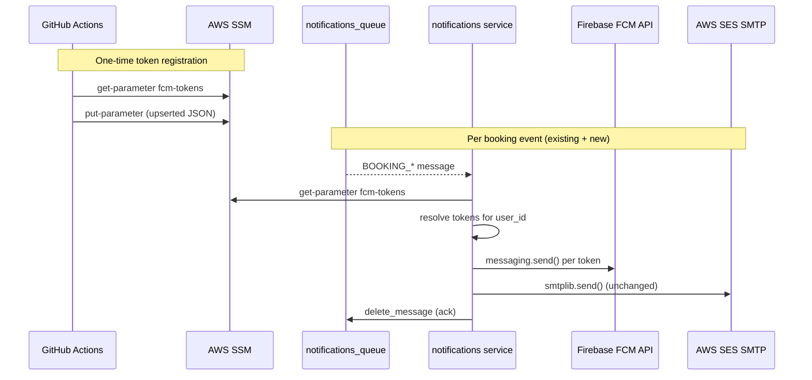

# Technical Plan: Push Notifications for Booking Status Changes

**Based on:** `specs/push-notifications-booking-status/SPEC.md`  
**Created:** 2026-04-24

---

## Architecture Decisions

1. **`FcmPushSender` wraps `SsmTokenRegistry` internally** — handlers receive a single `PushSender` port and call `push.send(user_id=..., title=..., body=...)`. They never know about SSM or FCM internals. This keeps the port surface minimal and lets us swap implementations without touching handlers.

2. **SSM read per dispatched message** — `SsmTokenRegistry.get_tokens()` reads SSM on every call. This is acceptable for the low SQS throughput in dev and guarantees freshly-registered tokens are used immediately after the GitHub Actions workflow runs.

3. **`firebase-admin` named app** — `firebase_admin.initialize_app()` registers a global singleton. We use `firebase_admin.get_app(name)` / `initialize_app(name=...)` to allow re-initialization safely in tests without a `ValueError: The default Firebase app already exists`.

4. **Push errors are best-effort** — each handler wraps the push call in `try/except Exception` and logs a warning. The SQS message is still acknowledged so the email delivery succeeds even if FCM is misconfigured. This mirrors the existing email pattern where `EmailSendError` propagates, but for push we treat it as non-critical.

5. **`FIREBASE_CREDENTIALS_JSON` stored as SSM SecureString** — the service account JSON is sensitive. It is stored in SSM and referenced from the ECS task definition `secrets` block (not `environment_variables`).

6. **Token registration via GitHub Actions with `jq`** — the workflow reads the SSM parameter, uses `jq` to upsert the token (deduplicating via `unique`), then writes back with `--overwrite`. This avoids embedding Python in shell and `jq` is always available on `ubuntu-latest` runners.

---

## Service Breakdown

---

### `services/notifications/` (Python / FastAPI / hexagonal)

**Pattern:** Hexagonal — new port in `application/ports.py`, two new adapters in `infrastructure/`, 7 handler modifications in `application/`, wired in `bootstrap.py`.

**Files to create:**

```
services/notifications/src/notifications/infrastructure/fcm_push_sender.py
services/notifications/src/notifications/infrastructure/ssm_token_registry.py
```

**Files to modify:**

```
services/notifications/src/notifications/application/ports.py
services/notifications/src/notifications/application/handle_booking_approved.py
services/notifications/src/notifications/application/handle_booking_cancelled.py
services/notifications/src/notifications/application/handle_booking_confirmed.py
services/notifications/src/notifications/application/handle_booking_created.py
services/notifications/src/notifications/application/handle_booking_dates_changed.py
services/notifications/src/notifications/application/handle_booking_rejected.py
services/notifications/src/notifications/application/handle_payment_confirmed.py
services/notifications/src/notifications/config.py
services/notifications/src/notifications/bootstrap.py
services/notifications/pyproject.toml
```

**No DB migration** — SSM is the only storage.

---

#### Precise change: `application/ports.py`

Add a second Protocol alongside `EmailSender`:

```python
class PushSender(Protocol):
    """Port for sending a push notification to a user's registered devices."""

    def send(self, *, user_id: str, title: str, body: str) -> None: ...
```

---

#### Precise change: `infrastructure/ssm_token_registry.py` (NEW)

```python
import json
import logging
from typing import Any

logger = logging.getLogger(__name__)


class SsmTokenRegistry:
    """Reads FCM device tokens from an SSM parameter (JSON dict user_id → [token, ...])."""

    def __init__(self, *, ssm_client: Any, parameter_path: str) -> None:
        self._ssm = ssm_client
        self._path = parameter_path

    def get_tokens(self, user_id: str) -> list[str]:
        try:
            response = self._ssm.get_parameter(Name=self._path)
            data = json.loads(response["Parameter"]["Value"])
            return data.get(user_id, [])
        except self._ssm.exceptions.ParameterNotFound:
            return []
        except Exception:
            logger.warning("ssm token registry read failed for path %s", self._path)
            return []
```

---

#### Precise change: `infrastructure/fcm_push_sender.py` (NEW)

```python
import json
import logging

import firebase_admin
from firebase_admin import credentials, messaging

from notifications.infrastructure.ssm_token_registry import SsmTokenRegistry

logger = logging.getLogger(__name__)

_APP_NAME = "travelhub-notifications"


class FcmPushSender:
    """Sends FCM push notifications via firebase-admin SDK."""

    def __init__(
        self,
        *,
        credentials_json: str,
        project_id: str,
        token_registry: SsmTokenRegistry,
    ) -> None:
        # initialize_app raises if name already exists — guard for test re-use
        try:
            self._app = firebase_admin.get_app(name=_APP_NAME)
        except ValueError:
            cred = credentials.Certificate(json.loads(credentials_json))
            self._app = firebase_admin.initialize_app(
                cred, {"projectId": project_id}, name=_APP_NAME
            )
        self._registry = token_registry

    def send(self, *, user_id: str, title: str, body: str) -> None:
        tokens = self._registry.get_tokens(user_id)
        if not tokens:
            logger.debug("no fcm tokens registered for user_id=%s, skipping push", user_id)
            return
        for token in tokens:
            msg = messaging.Message(
                notification=messaging.Notification(title=title, body=body),
                token=token,
            )
            messaging.send(msg, app=self._app)
            logger.info("fcm push sent to token=...%s for user_id=%s", token[-6:], user_id)
```

---

#### Precise change: handler files (×7)

All 7 handlers follow the same pattern. Example using `HandleBookingCreated`:

```python
# Before
class HandleBookingCreated:
    def __init__(self, email_sender: EmailSender) -> None:
        self._email = email_sender

    def __call__(self, event: BookingCreatedEvent) -> None:
        subject = "..."
        body = "..."
        self._email.send(to=event.user_email, subject=subject, body=body)

# After
import logging
from notifications.application.ports import EmailSender, PushSender

logger = logging.getLogger(__name__)

class HandleBookingCreated:
    def __init__(self, email_sender: EmailSender, push_sender: PushSender) -> None:
        self._email = email_sender
        self._push = push_sender

    def __call__(self, event: BookingCreatedEvent) -> None:
        subject = "..."
        body = "..."        # long email body (unchanged)
        push_body = f"Tu reserva para la propiedad {event.property_id} fue creada."
        self._email.send(to=event.user_email, subject=subject, body=body)
        try:
            self._push.send(user_id=event.user_id, title=subject, body=push_body)
        except Exception:
            logger.warning("push failed for booking %s", event.booking_id)
```

Push body strings per event type (short, suitable for Android notification panel):

| Handler | push title (= email subject) | push body |
|---|---|---|
| `HandleBookingCreated` | `"Tu reserva {id} fue creada"` | `"Recibimos tu solicitud para la propiedad {property_id}."` |
| `HandleBookingApproved` | `"Tu reserva {id} fue aprobada"` | `"Ya puedes proceder con el pago para confirmar tu reserva."` |
| `HandleBookingConfirmed` | `"Tu reserva {id} está confirmada"` | `"Tu reserva ha sido confirmada. ¡Hasta pronto!"` |
| `HandleBookingRejected` | `"Tu reserva {id} fue rechazada"` | `"Tu reserva fue rechazada: {rejection_reason}."` |
| `HandleBookingCancelled` | `"Tu reserva {id} fue cancelada"` | `"Tu reserva fue cancelada. Reembolso: ${refund_amount}."` |
| `HandleBookingDatesChanged` | `"Fechas de tu reserva {id} actualizadas"` | `"Nuevas fechas: {new_period_start} → {new_period_end}."` |
| `HandlePaymentConfirmed` | `"Pago de tu reserva {id} confirmado"` | `"Pago ref. {payment_reference} recibido. ¡Todo listo!"` |

---

#### Precise change: `config.py`

Add three settings:

```python
# Firebase / FCM
FIREBASE_CREDENTIALS_JSON: str = ""   # service account JSON string
FIREBASE_PROJECT_ID: str = ""

# SSM path for FCM token registry
FCM_TOKENS_SSM_PATH: str = "/final-project-miso/notifications/fcm-tokens"
```

---

#### Precise change: `bootstrap.py`

```python
# add imports
from notifications.infrastructure.fcm_push_sender import FcmPushSender
from notifications.infrastructure.ssm_token_registry import SsmTokenRegistry

def build_consumer() -> SqsConsumer:
    email_sender = SmtpEmailSender(...)  # unchanged

    ssm_client = boto3.client("ssm", region_name=settings.AWS_REGION)
    token_registry = SsmTokenRegistry(
        ssm_client=ssm_client,
        parameter_path=settings.FCM_TOKENS_SSM_PATH,
    )
    push_sender = FcmPushSender(
        credentials_json=settings.FIREBASE_CREDENTIALS_JSON,
        project_id=settings.FIREBASE_PROJECT_ID,
        token_registry=token_registry,
    )

    dispatcher = MessageDispatcher(
        booking_created_handler=HandleBookingCreated(email_sender, push_sender),
        booking_approved_handler=HandleBookingApproved(email_sender, push_sender),
        booking_cancelled_handler=HandleBookingCancelled(email_sender, push_sender),
        booking_dates_changed_handler=HandleBookingDatesChanged(email_sender, push_sender),
        booking_confirmed_handler=HandleBookingConfirmed(email_sender, push_sender),
        booking_rejected_handler=HandleBookingRejected(email_sender, push_sender),
        payment_confirmed_handler=HandlePaymentConfirmed(email_sender, push_sender),
    )
    ...
```

Note: `build_consumer()` must guard against missing Firebase credentials. If `FIREBASE_CREDENTIALS_JSON` is empty, use a **no-op push sender** stub so the service still starts in environments where FCM is not configured:

```python
push_sender: PushSender
if settings.FIREBASE_CREDENTIALS_JSON and settings.FIREBASE_PROJECT_ID:
    push_sender = FcmPushSender(...)
else:
    push_sender = _NoOpPushSender()  # defined inline in bootstrap.py
```

`_NoOpPushSender` is a tiny private class in `bootstrap.py`:

```python
class _NoOpPushSender:
    def send(self, *, user_id: str, title: str, body: str) -> None:
        logger.debug("push notifications disabled (no FCM credentials configured)")
```

---

#### Precise change: `pyproject.toml`

Add to `[project] dependencies`:

```toml
"firebase-admin>=6.0.0",
```

---

### `.github/workflows/register_push_token.yml` (NEW)

```yaml
name: Register FCM Push Token

on:
  workflow_dispatch:
    inputs:
      user_id:
        description: "Cognito user sub (user_id)"
        required: true
      fcm_token:
        description: "FCM device registration token"
        required: true
      environment:
        description: "Target environment"
        required: true
        default: develop

jobs:
  register:
    name: Upsert FCM token in SSM
    runs-on: ubuntu-latest
    steps:
      - name: Configure AWS credentials
        uses: aws-actions/configure-aws-credentials@v4
        with:
          aws-access-key-id: ${{ secrets.AWS_ACCESS_KEY_ID }}
          aws-secret-access-key: ${{ secrets.AWS_SECRET_ACCESS_KEY }}
          aws-region: us-east-1

      - name: Upsert token in SSM parameter
        env:
          PARAM: "/final-project-miso/notifications/fcm-tokens"
          USER_ID: ${{ inputs.user_id }}
          FCM_TOKEN: ${{ inputs.fcm_token }}
        run: |
          CURRENT=$(aws ssm get-parameter --name "$PARAM" \
            --query "Parameter.Value" --output text 2>/dev/null || echo '{}')
          UPDATED=$(echo "$CURRENT" | jq \
            --arg uid "$USER_ID" \
            --arg tok "$FCM_TOKEN" \
            '.[$uid] = ((.[$uid] // []) + [$tok] | unique)')
          aws ssm put-parameter \
            --name "$PARAM" \
            --value "$UPDATED" \
            --type String \
            --overwrite
          echo "Token registered for user_id=$USER_ID"
```

---

### `terraform/environments/develop/ecs_api/terraform.tfvars` (MODIFY)

Add to the `"notifications"` service block:

```hcl
secrets = [
  # ... existing SMTP secrets unchanged ...
  {
    name      = "FIREBASE_CREDENTIALS_JSON"
    valueFrom = "/final-project-miso/notifications/firebase_credentials_json"
  },
  {
    name      = "FIREBASE_PROJECT_ID"
    valueFrom = "/final-project-miso/notifications/firebase_project_id"
  },
]
environment_variables = [
  {
    name  = "FCM_TOKENS_SSM_PATH"
    value = "/final-project-miso/notifications/fcm-tokens"
  }
]
```

Note: `FIREBASE_CREDENTIALS_JSON` is a `SecureString` in SSM (the service account JSON is sensitive). `FCM_TOKENS_SSM_PATH` is a plain env var — just a path, not a secret.

---

## Interface Contracts

### Service-to-service calls

No new HTTP calls between backend services. The notifications service only communicates with:
- **SQS** (reads, existing) — `notifications_queue`
- **AWS SSM** (reads, new) — `GET /final-project-miso/notifications/fcm-tokens`
- **Firebase FCM HTTP v1** (writes, new) — via `firebase-admin` SDK

### No new SQS event types

All 7 existing event types are reused. No schema changes are needed in `booking_orchestrator`.

---

## Cross-Service Dependency Diagram



---

## Risk Flags

- **`firebase-admin` adds ~40 MB to the Docker image** — the notifications service is currently minimal. Accept for now; image size is not a concern in dev/educational context.
- **SSM IAM permissions** — the ECS task role for `notifications` must have `ssm:GetParameter` on the `fcm-tokens` path. Verify the existing IAM policy in `terraform/modules/ecs_service/` covers this, or add it explicitly.
- **`firebase_admin.initialize_app` singleton** — calling it twice raises `ValueError`. The guard (`get_app` then `initialize_app`) in `FcmPushSender.__init__` handles this but requires the named app pattern. Tests that instantiate `FcmPushSender` must mock `firebase_admin` entirely to avoid hitting real Firebase.
- **SSM 4 KB limit** — SSM standard parameters cap at 4 KB. For a small dev team this is fine. If the token registry grows, switch to an advanced parameter (8 KB) or DynamoDB.
- **Shell injection in GitHub Action** — user_id and fcm_token are passed as `jq` args via `--arg`, which handles quoting safely. No shell injection risk.

---

## Implementation Order

1. `pyproject.toml` — add `firebase-admin` (unblocks all other files that import it)
2. `application/ports.py` — add `PushSender` Protocol (unblocks all handler changes)
3. `infrastructure/ssm_token_registry.py` — new adapter
4. `infrastructure/fcm_push_sender.py` — new adapter (depends on `SsmTokenRegistry`)
5. `config.py` — add new settings (unblocks `bootstrap.py`)
6. `application/handle_*.py` (×7) — inject `PushSender` (can all be done in parallel)
7. `bootstrap.py` — wire everything together
8. `.github/workflows/register_push_token.yml` — new workflow (independent, can be done any time)
9. `terraform/environments/develop/ecs_api/terraform.tfvars` — add FCM env vars (devops-engineer)
