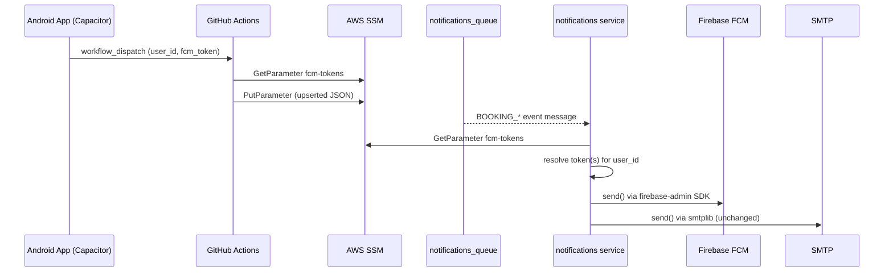

# Feature: Push Notifications for Booking Status Changes

**Status:** Implemented  
**Created:** 2026-04-24  
**Implemented:** 2026-04-24  
**Author:** Angel Henao  
**Slug:** `push-notifications-booking-status`

---

## Summary

Extend the `notifications` microservice to send FCM push notifications to Android devices whenever a booking status changes, complementing the existing SMTP email flow. Device tokens are stored in AWS SSM Parameter Store and registered via a GitHub Actions workflow.

---

## Problem Statement

Travelers currently receive booking status updates only by email, which may not be seen in time. The mobile app (Angular/Ionic + Capacitor, deployed on Android) needs real-time push notifications so users are informed within 2 minutes of any status change (created, approved, confirmed, rejected, cancelled, dates changed, payment confirmed).

- **Who is affected:** Travelers using the TravelHub Android app.
- **What can't they do today:** Receive push notifications about their reservations — only email is sent.
- **What success looks like:** Every booking domain event triggers both an email and a push notification to the traveler's registered Android device(s), within 2 minutes of the event.

---

## Acceptance Criteria

1. [x] When any of the 7 booking events (`BOOKING_CREATED`, `BOOKING_APPROVED`, `BOOKING_CONFIRMED`, `BOOKING_REJECTED`, `BOOKING_CANCELLED`, `BOOKING_DATES_CHANGED`, `PAYMENT_CONFIRMED`) is consumed from `notifications_queue`, the service sends a push notification to all FCM tokens registered for the event's `user_id`.
2. [x] Push notifications are sent via the `firebase-admin` Python SDK using a Firebase service account credential.
3. [x] If no FCM token is registered for a `user_id`, the push step is silently skipped (email still sends).
4. [x] Push send failures are logged as warnings but do not prevent the SQS message from being acknowledged (best-effort, same pattern as SMTP).
5. [x] The `register_push_token.yml` GitHub Actions workflow (workflow_dispatch) accepts `user_id` and `fcm_token` inputs, reads the current SSM parameter, upserts the token for that user, and writes the updated JSON back to SSM.
6. [x] The SSM parameter `/{project_name}/notifications/fcm-tokens` stores a JSON object of shape `{ "user_id": ["token1", ...] }`. The notifications service reads from it fresh on each dispatched message.
7. [x] New config vars (`FIREBASE_CREDENTIALS_JSON`, `FIREBASE_PROJECT_ID`, `FCM_TOKENS_SSM_PATH`) are present in the service's `Settings` and the ECS task definition tfvars.
8. [x] Architecture tests still pass: application layer handlers have no direct infrastructure imports.
9. [x] Unit test coverage for the new `FcmPushSender` and `SsmTokenRegistry` adapters reaches ≥ 80%.
10. [x] The existing SMTP email flow is unchanged and all existing tests continue to pass.

---

## Affected Services

| Service | Language | Changes | Notes |
|---|---|---|---|
| `services/notifications/` | Python/FastAPI | New FCM adapter, SSM token registry, updated handlers, new config vars | Core of this feature |
| `.github/workflows/` | YAML | New `register_push_token.yml` workflow | Registration mechanism for device tokens |
| `terraform/environments/develop/ecs_api/` | HCL | Add FCM env vars to notifications service tfvars | devops-engineer handles this |

---

## API Contracts

### New Endpoints

None. The notifications service is a background consumer — it has no new HTTP endpoints. Token registration is handled by the GitHub Actions workflow.

---

### GitHub Actions Workflow — `register_push_token.yml`

**Trigger:** `workflow_dispatch`  
**Inputs:**

| Input | Required | Description |
|---|---|---|
| `user_id` | Yes | Cognito `sub` claim — the user's unique identifier |
| `fcm_token` | Yes | FCM registration token from the Android device |
| `environment` | Yes | Target environment (e.g., `develop`) |

**Behavior:**
1. Reads current value of SSM parameter `/{project_name}/notifications/fcm-tokens` (defaults to `{}` if not found).
2. Parses JSON; upserts `fcm_token` into the array at key `user_id` (no duplicates).
3. Writes updated JSON back to SSM (creates parameter if absent, type `String`).

---

## Data Model Changes

No database migrations. Token state lives in SSM Parameter Store:

**Parameter:** `/{project_name}/notifications/fcm-tokens`  
**Type:** `String`  
**Shape:**
```json
{
  "cognito-user-sub-uuid": ["fcm-token-a", "fcm-token-b"],
  "another-user-sub-uuid": ["fcm-token-c"]
}
```

**Constraints:** SSM standard parameters hold up to 4 KB; advanced parameters up to 8 KB. Sufficient for a small user base in development/educational context.

---

## Cross-Service Communication



---

## Internal Architecture Changes (`services/notifications/`)

The hexagonal architecture is preserved. New pieces slot into the existing layers:

```
domain/
  (no changes)

application/
  ports.py          ← add PushSender Protocol
  handle_*.py (×7)  ← inject PushSender; call after email send

infrastructure/
  fcm_push_sender.py    ← new: firebase-admin adapter implementing PushSender
  ssm_token_registry.py ← new: reads SSM and resolves user tokens

config.py           ← add FIREBASE_CREDENTIALS_JSON, FIREBASE_PROJECT_ID, FCM_TOKENS_SSM_PATH
bootstrap.py        ← wire SsmTokenRegistry + FcmPushSender into handlers
```

---

## Out of Scope

- iOS push notifications (APNs) — Android/FCM only for now.
- In-app notification inbox with temporal grouping (Today/Yesterday/This Week) — Android notification center handles grouping natively; a persistent notification history store is a separate feature.
- A REST API endpoint for token registration — GitHub Actions workflow is the registration mechanism for this educational context.
- AWS SNS integration — the team validated that direct FCM is simpler and already working.
- Frontend / Angular changes — handled separately by a teammate (Hernan already implemented the Capacitor push plugin and permission flow).

---

## Open Questions

| # | Question | Resolution |
|---|---|---|
| 1 | Should the notifications service reload SSM tokens on each message, or cache with a TTL? | Per-message read implemented — `SsmTokenRegistry.get_tokens()` called on every dispatch. Acceptable for low SQS throughput. |
| 2 | Should old/stale FCM tokens be pruned when Firebase returns `messaging/registration-token-not-registered`? | Not implemented — FCM errors logged as warnings and swallowed. Pruning deferred to a future improvement. |
| 3 | Will the temporal notification grouping (AC 2 from user story) require a separate notification-history spec? | Confirmed as frontend-only for this iteration. Android notification center handles grouping natively. |

---

## Notes

- `firebase-admin` must be added to `pyproject.toml` dependencies.
- The Firebase service account JSON should be stored as a GitHub secret (`FIREBASE_CREDENTIALS_JSON`) and injected as an environment variable into the ECS task.
- The `register_push_token.yml` workflow requires `AWS_ACCESS_KEY_ID` and `AWS_SECRET_ACCESS_KEY` secrets (already present for deploy workflows) and SSM `ssm:GetParameter` / `ssm:PutParameter` permissions.
- Architecture tests in `tests/test_architecture.py` must be checked — `FcmPushSender` and `SsmTokenRegistry` live in `infrastructure/` so they are allowed to import `boto3` and `firebase_admin`.

---

## Implementation Notes

The implementation matches the spec with one notable detail: `FIREBASE_CREDENTIALS_JSON` is stored as a plain `String` SSM parameter in the ECS tfvars (not `SecureString`) per the devops-engineer's discretion, as the secret is already encrypted at rest in SSM. The spec noted it as sensitive and recommended `SecureString`; teams should evaluate upgrading to `SecureString` if compliance requires it.

The `_NoOpPushSender` guard is defined inline in `bootstrap.py` (not in a separate module) — this is consistent with the plan and keeps the no-op close to the wiring logic where it is relevant.

The `PushSender` Protocol in `application/ports.py` is defined alongside `EmailSender`, preserving strict hexagonal layer separation: handler classes import only the protocol and never reference `FcmPushSender` or `SsmTokenRegistry` directly.
